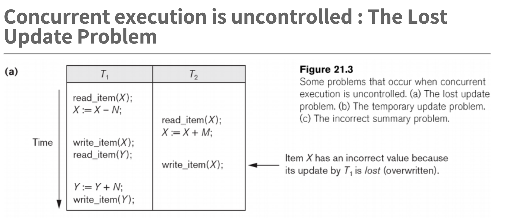
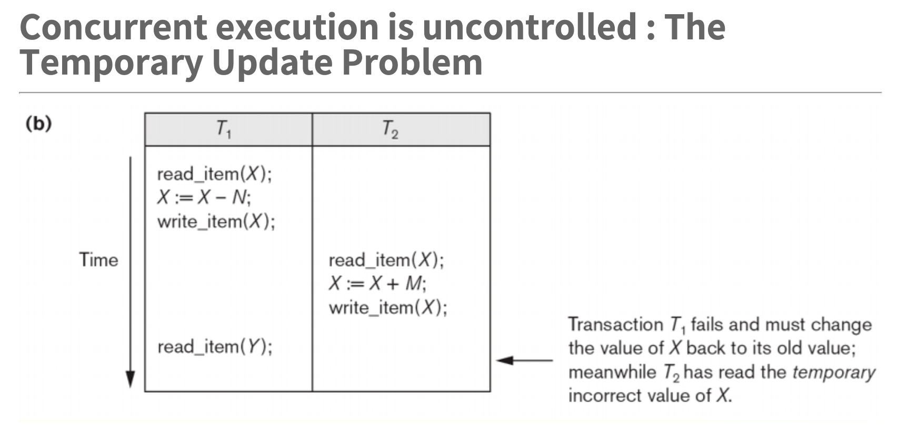
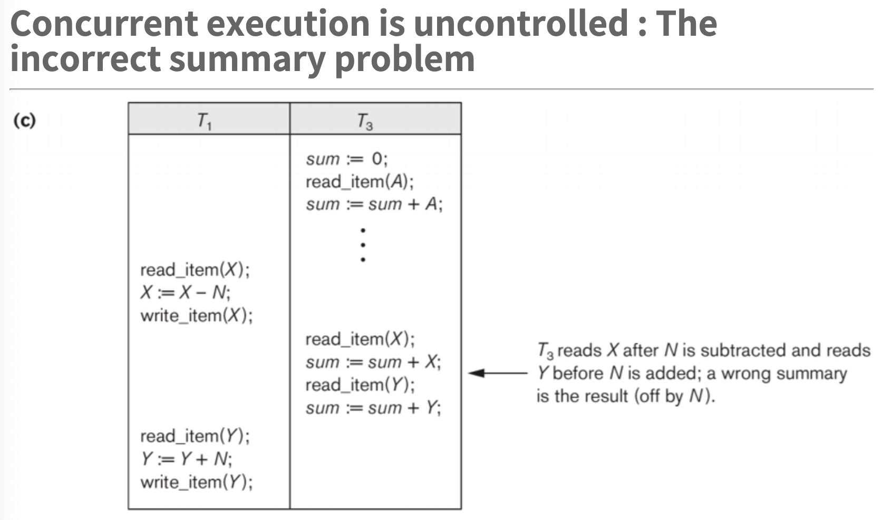
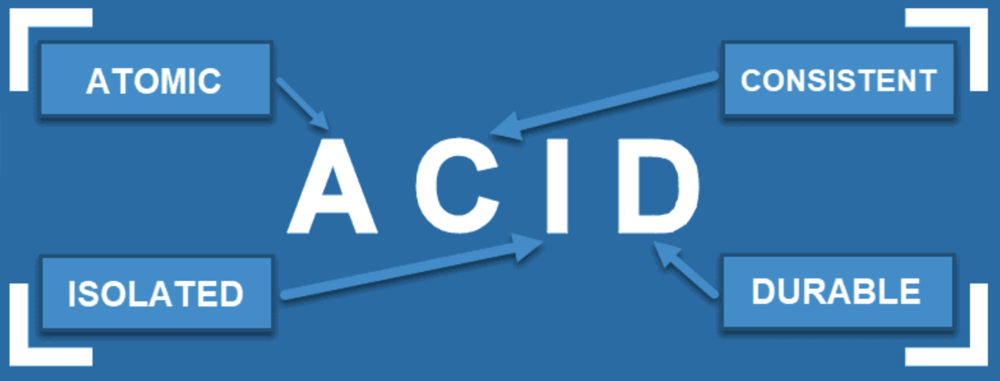
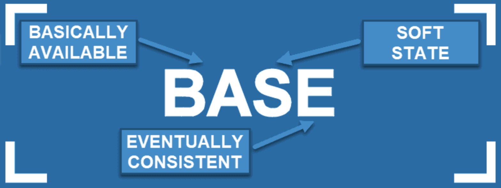

### 트랜잭션에는 병행제어가 필요하다

다수의 사용자가 데이터베이스에 요청을 보냈는데 하나 요청 끝내고 다른 요청을 수행하는 Serial 방식이라면 처리가 매우 오래 걸릴 것이다.

따라서, 데이터베이스는 “**병행 처리**"를 한다

그러나 병행 처리를 하면서 다양한 문제점들이 발생한다.

1. `The Lost Update Problem`

   : 두개의 트랜잭션이 동일한 아이템에 접근하여 서로의 연산이 중첩될 때 결과적으로 올바르지 않은 값이 저장될 수 있다

1. `The Temporary Update (or Dirty Read) Problem`

   : 한 트랜잭션이 값을 업데이트 하다가 중간에 트랜잭션이 fail 하여 rollback하게 되지만 다른 트랜잭션에서 rollback하기 이전의 값(즉, 올바르지 않은 값)을 읽게 될 수 있다.

1. `The Incorrect Summary Problem`

   : 한 트랙잭션이 aggregate 함수(Sum, Max, Min 등)를 실행하고 있는데 다른 트랜잭션이 이 값들 중 하나를 업데이트하고 있을 때 aggregate 트랜잭셔닝 값이 업데이트되기 이전의 값을 사용할 수 있다.

## ACID vs BASE

## ACID

- Atomic - 모든 트랜잭션이 성공적으로 수행되거나 아니면 실패해서 트랙잭션이 시작될 때의 상태로 돌아가게 한다 → 데이터베이스의 데이터들이 모두 “valid”할 것을 보장한다
- Consistent - 데이터베이스의 “structural integrity”는 절대 바뀌지 않는다
- Isolated - 각 트랜잭션은 다른 트랜잭션에 영향을 미치지 않는다
- Durable - 데이터는 어떤 상황에서도 잘 보존된다 (e.g. poor network connection, when transaction fails)

### ACID Use Case

- 은행 관련 업무
- RDBMS

#`consistency` #`predictability` #`reliability`

## BASE

- Basically Available - 무조건적으로 일관성을 추구하기보다는 BASE-modelled NoSQL 데이터베이스는 데이터를 여러 노드 간의 복사나 확장을 통해서 접근을 허용해준다
- Soft State - 데이터는 시간에 따라 계속 변한다
- Eventually Consistent - BASE는 “immediate consistency”를 절대로 지켜낼 수는 없지만 data reads는 언제나 가능하다

### BASE Use Case

- Marketing or Customer Service Companies → social network search를 하는데 있어서 유연성이 높은 BASE를 더 선호할 것
- NoSQL

#`flexibility` #`scalability`

### 참고자료

[https://phoenixnap.com/kb/acid-vs-base](https://phoenixnap.com/kb/acid-vs-base)

[https://jhkang-tech.tistory.com/103](https://jhkang-tech.tistory.com/103)
