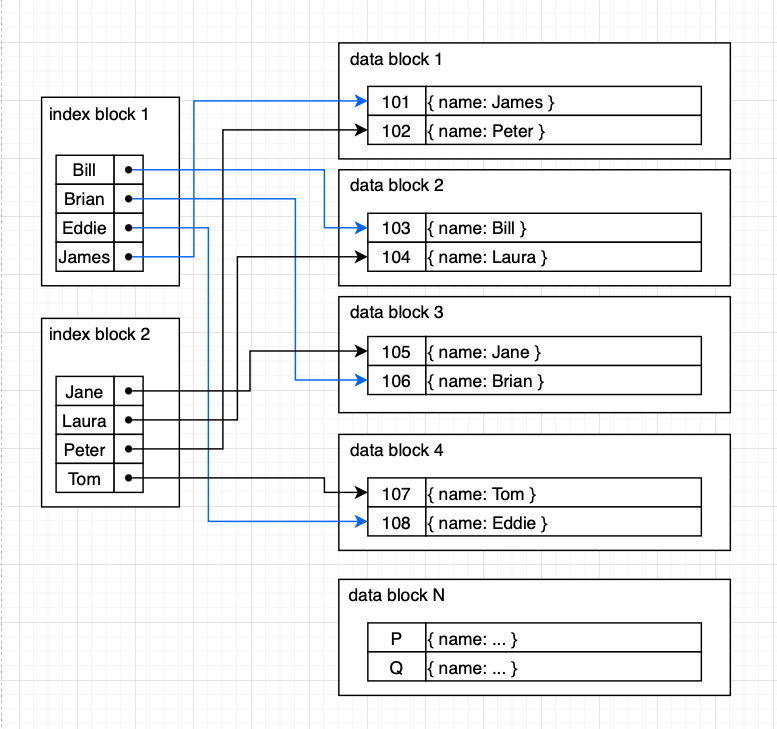

# 2022-03-05

# 인덱스 (index)

<aside>
💡 인덱스는 데이터 베이스 테이블에 대한 검색 성능의 속도를 높여주는 자료구조.

</aside>


## 자료구조

### 해시 테이블(hash Table)

- key 값을 이용해 대응되는 value 값을 구하는 방식
- 평균 적으로 O(1)의 매우 빠른 시간에 원하는 데이터 탐색
- (Key, value) = (컬럼의 값, 데이터의 위치) 로 구현
    - 실제로 인덱스에서 잘사용되지 않음.
    - **등호(=) 연산에 최적화** 되어 있기 때문 (**실제 query**에서는 **부등호 연산이 자주 사용됨**.)

### B-Tree


- **Binary Search tree와 유사**하지만, 한 노드 당 자식 노드가 2개 이상 가능함.
- 균형 트리 (루트로부터 리프까지의 거리가 일정)
- 시간복잡도: O(logN)
- 모든 데이터 순회 시 트리의 모든 노드를 방문해야 하므로 비효율적
  
    

### B+Tree


- leaf node 에만 데이터 저장. non-leaf node에서는 자식의 포인터만 저장
- leaf node 끼리는 linked list로 연결
  
    → full scan 시 한번의 선형 탐색
    
- 이러한 B-TREE의 단점을 개선 시킨 자료구조

- InnoDB B+tree 구조
  
    ## InnoDB B+tree 구조
    
    - innoDB의 data storage는 tablespace라고하는 space 모델 사용
    - `**space**`: 물리적으로 여러 파일로 구성되거나, 논리적으로 하나의 파일이라 할 수 있음.
    - `**page**`: 각각의 space는 page로 구성되고, 기본적으로 하나의 page는 16KB
    
    ### Leaf and non-leaf page
    
    - linked list 는 infimum(최하점)에서 시작하고, 모든 record는 키에 따라 오름차순으로 연결하고 supremum(최상점)에서 종료함.
    - leaf, non-leaf 페이지 모두에서 각 레코드에는 다음 레코드에 대한 offset을 가리키는 포인터가 포함 됨.
    
    리프 페이지에는 각 레코드에 포함된 "데이터"의 일부로 NON-FIELDS가 포함됩니다.
    
    
    
    - record의 value 값은 data
    
    
    
    - 자식 페이지의 번호와, 자식 페이지의 최소키를 가지고 있음.
    
    ## Pages at the same level
    
    
    
    
    
    - 같은 레벨의 노드들 끼리는 double linked list, 자식노드로는 single linked list로 연결 됨.
    - key의 범위마다 찾아가야 할 페이지 넘버(포인터)가 있는데, 해당 페이지 넘버를 통해 곧 바로 다음 노드로 넘어간다.
    - 리프 노드에 다다랐을 때, 디스크에 존재하는 데이터의 주소 값을 구할 수 있고, linked list를 통해 선형 탐색도 가능
    
    [B+Tree index structures in InnoDB](https://blog.jcole.us/2013/01/10/btree-index-structures-in-innodb/)
    

---

# 인덱스 종류

## 데이터 범위 기준

### Dense index


- 모든 record에 대해 index가 생성 됨.
- 검색 속도는 빠르지만 index 저장 공간이 낭비 됨.

### Sparse index


- 일부 레코드에 대해서 index가 생성 됨.

  → 저장 공간이 절약 되지만 Dense index 보단 검색 속도가 느림.

- 보통 Data 블록 하나의 index가 생성

---

## 키 기준

## primary index

- **중복을 포함하지 않는** 필드 집합에 대한 인덱스
  
    - 하나의 테이블에 **오직 하나의 기본 인덱스**만 생성됨.
- 데이터 블록들 안의 행들이 인덱스 키로 정렬 됨.
  
    → **범위로 질의**하는 것에 유리함.
    


- id 106번 탐색
    - index block scan(I/O 1~2) →data block 3 scan(I/O 1) , **총 2~3번**의 I/O 발생
- id 가 101~104번 탐색
    - index block scan(I/O 1~2) →data block1,2 scan(I/O 2) , **총 3~4번**의 I/O 발생

## secondary index

- 기본 인덱스가 아니고, **중복을 포함**할 수 있는 인덱스
- 테이블 당 여러개 가질 수 있음.
- data record가 정렬되어 있지 않음.
  
    → 모든 레코드에 대한 index를 가져야 함.(공간을 많이 차지)
    
    → 범위 조건으로 검색하게 되면 많은 I/O가 발생할 수 있음.
    



- name이 jane인 학생을 찾는 경우는 id 105를 찾는 과정과 비슷
    - 다만 중복 데이터를 포함하기 때문에 인덱스 block을 전부 확인 해야 함.
- ASCII Code, 알파벳 순서대로 Bill~James 의 범위의 레코드를 가져오는 경우
    - data block1, data block2, data block3, data block4를 모두 읽어야 함
- 이처럼 범위로 데이터 검색하는 경우 primary index에 비해 불리

---

## Composite index (결합 인덱스)

- 두개 이상의 컬럼을 합쳐서 인덱스를 만드는 것을 말함.
- 결합할 컬럼들 간의 순서 중요 (최대한 많은 데이터를 걸러내야 함)
    - ex) (성별, 이름) 컬럼을 가지는 테이블
    - case1: 100 rows → male → 50rows → smith → 2 rows
    - case2: 100 rows → smith → 2rows → male → 2 rows

### Column Ordering

1. 항상 사용하는지
2. ‘=’으로 사용하는지
   
    col1 col2
    
    AB    20150707
    
    ABC    20150700
    
    ```java
    select col1, col2
    from tbl_dummy
    where col1 like 'A%'
    and col2 = '20150707'
    ```
    
3. 분포도가 좋은 컬럼
4. 자주 이용되는 sort 순서

---

# index의 성능과 고려해야 할 사항

### index 선정

- 분포도가 좋아야 함.
- 자주 조합되어 사용되는 경우는 결합인덱스를 생성
- 결합 인덱스는 구성되는 컬럼 순서 선정(사용빈도, ‘=’, 분포도, sort)
- 가능한 수정이 빈번하지 않는 컬럼을 선정
- 가능한 한 컬럼이 여러 인덱스에 포함되지 않도록 함.
- 기본키 및 외부키 (조인의 연결고리가 되는 컬럼)가 되는 컬럼을 선정

### **인덱스 생성시 고려사항**

- 새로 추가된 인덱스는 기존 엑세스 경로에 영향을 미칠 수가 있음.
- 지나치게 많은 인덱스는 많은 오버헤드를 발생 시킴
- 넓은 범위를 인덱스로 처리시 많은 오버헤드 발생 시킴
- 인덱스를 위한 추가적인 저장공간이 필요 함.
- 인덱스의 개수는 테이블의 사용형태에 따라 다름. (검색위주형, 동시 다량처리형, 단일 처리형, 배치처리형)
- 분포도가 양호한 컬럼도 처리 조건(범위)에 따라 분포도가 나빠 질 수 있음.
- NULL 값을 가지는 컬럼의 인덱스 ENTRY는 생성되지 않음.
- 조인(join)시에 인덱스가 사용되지 않으면 엑세스 경로는 무조건 특정 형태로 고정 되어짐.

### 참고

[Data Structures](http://www.btechsmartclass.com/data_structures/b-trees.html)

[B+Tree index structures in InnoDB](https://blog.jcole.us/2013/01/10/btree-index-structures-in-innodb/)

[What is the Difference Between Primary and Secondary Index - Pediaa.Com](https://pediaa.com/what-is-the-difference-between-primary-and-secondary-index/)