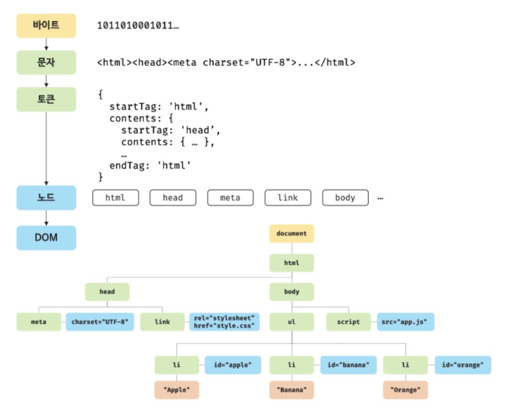
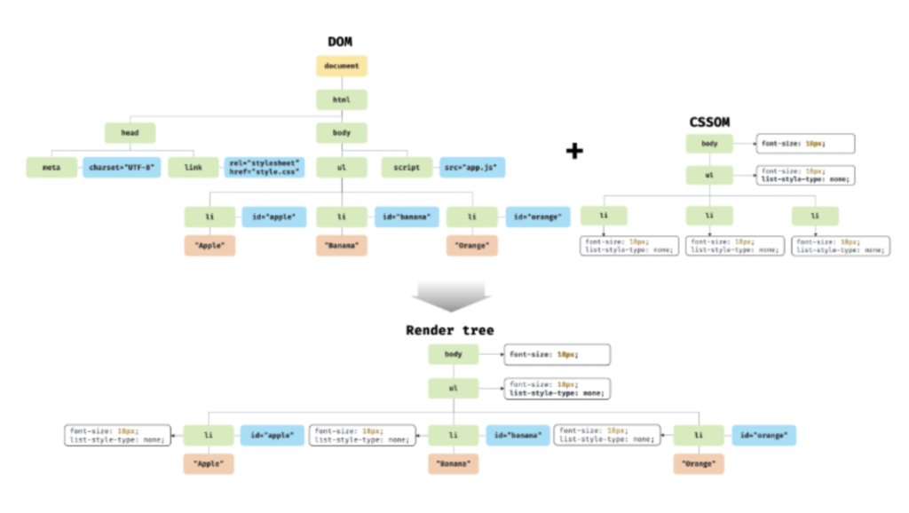
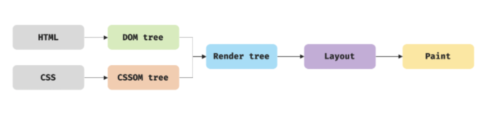
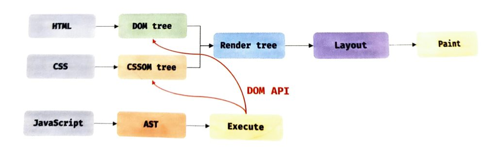

# 브라우저 렌더링 방식

## 브라우저 렌더링의 전반적인 과정

1. 브라우저는 HTML, CSS, JS, 이미지, 폰트파일 등 렌더링에 필요한 리소스를 서버에 요청하고 응답을 받음.
2. 브라우저 렌더링 엔진은 HTML과 CSS를 파싱하여 DOM과 CSSOM을 생성하고, 이 둘을 참고하여 렌더트리를 생성함.
3. 브라우저의 자바스크립트 엔진은 자바스크립트를 파싱하여 AST(Abstract Syntax Tree)를 생성하고 바이트 코드로 변환하여 실행함. 만약, 자바스크립트가 DOM API를 이용해서 DOM이나 CSSOM을 변경한다면, 변경된 DOM과 CSSOM은 렌더트리로 다시 결합됨.
4. 결합된 렌더트리를 기반으로 HTML요소의 레이아웃을 계산하고 브라우저에 페인팅함.

## HTML파싱과 DOM 생성

1. 서버는 HTML문서을 바이트 파일로 응답한다.
2. 브라우저는 바이트 형태의 문서를 meta태그에 명시된 charset(인코딩방식)에 따라 문자열로 변환함.
3. 문자열로 변환된 HTML문서를 의미를 갖는 최소 단위인 토큰으로 분해함.
4. 토큰은 노드라는 객체로 변환된다.
5. 생성된 노드는 HTML요소간의 부자관계에 따라 DOM(Document Object Model)으로 구성됨.

## CSS파싱과 CSSOM 생성

렌더링 엔진은 HTML문서를 한줄 한줄 순차적으로 파싱하며 DOM을 생성해 나감. 그러다 CSS를 로드하는 link or style 태그를 만나면 DOM 생성을 중지하고 CSSOM을 생성하는 과정으로 변환된다.

CSS파싱 과정도

> 바이트 > 문자 > 토큰 > 노드 > CSSOM

순으로 HTML파싱 과정과 동일함.

## 렌더트리 생성

렌더트리는 이름 그대로 렌더링을 위한 트래형태의 자료구조이다. 그렇기 때문에 화면에 그려지지 않는 노드들은 렌더트리에서 제외된다.
e.g. HTML의 meta태그, script태그 혹은 CSS의 display: none 요소 등

완성된 렌더트리는 레이아웃을 계산하고, 페인팅 처리에 입력됨. 이러한 과정은 렌더트리가 변경 될 때(혹은 그 아래 과정인 DOM 트리, CSSOM 트리가 변경될 때) 반복적으로 실행될 수 있다.

## 리플로우와 리페인트

자바스크립트 코드가 실행되는 과정에서 DOM과 CSSOM을 변경하는 DOM API가 사용되면 변경된 DOM과 CSSOM이 다시 렌더트리로 결합되고 레이아웃과 페인트 과정을 거쳐 다시 렌더링 된다.
이러한 과정을 리플로우, 리페인트라고 한다.
리플로우는 레이아웃을 다시 계산하는 것이고, 리페인트는 재결합된 렌더트리를 기반으로 다시 페인트하는 것이다. 리플로우는 노드의 추가/삭제, 요소의 크기/위치 변경, 윈도우의 리사이징 등 레이아읏에 영향을 주는 경우에만 실행된다.
레이아웃의 변화가 없다면 리페인트만 실행되기 때문에 리플로우와 리페인트가 반드시 순차적으로 실행되는 것은 아니다.

---

## 출처

[https://devcecy.com/%EB%B8%8C%EB%9D%BC%EC%9A%B0%EC%A0%80%EB%8A%94-%EC%96%B4%EB%96%BB%EA%B2%8C-%EB%A0%8C%EB%8D%94%EB%A7%81-%EB%90%A0%EA%B9%8C/](https://devcecy.com/%EB%B8%8C%EB%9D%BC%EC%9A%B0%EC%A0%80%EB%8A%94-%EC%96%B4%EB%96%BB%EA%B2%8C-%EB%A0%8C%EB%8D%94%EB%A7%81-%EB%90%A0%EA%B9%8C/)
