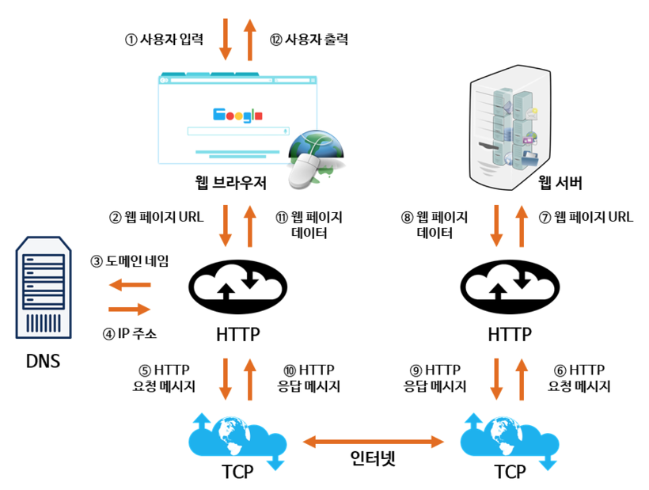

# 웹 통신의 큰 흐름

어플리케이션 레이어는 HTTP를 통신 레이어는 TCP를 사용한다는 가정이다.

(아래 번호의 순서는 위 사진의 번호와 무관합니다)

1. 사용자가 웹 브라우저를 통해 URL을 입력한다.
2. 브라우저는 입력된 URL 요소 중 host가 ip 주소인지 도메인 네임인지 확인한다. (ip 주소라면 4번부터 진행)
   a. 도메인 네임이라면 DNS Resolution과정을 거친다. (순서에 따라 요청하며 응답을 받는다면 다음 과정은 넘어간다)
3. DNS Resolution 과정을 거친다. (도메인 네임 → ip)
   a. 브라우저의 local cache를 확인한다.
   b. 컴퓨터의 DNS cache를 확인한다.
   c. 만약, local에서 찾지 못햇다면, dns server로 요청한다. (dns server는 계층적으로 관리됨.)
    - [dns server 계층 구조 이미지](https://velog.io/@sangmin7648/%EC%9B%B9-%ED%86%B5%EC%8B%A0%EC%9D%98-%ED%81%B0-%ED%9D%90%EB%A6%84)
4. URL에서 추출한 ip로 웹 서버가 위치한 컴퓨터를 찾아간다. w/ APR(IP → MAC), 라우팅 프로토콜(RIP, OSPF, EGP ...), NAT(Public IP → Private IP) 등등..
5. 웹 서버가 위치한 컴퓨터에 도착하면, 요청한 port와 연결된 socket으로 전송된다.
6. 웹 서버는 요청에 맞게 처리한 후, 다시 웹 브라우저에 응답한다.
7. 만약, 브라우저가 html을 요청했다면 html을 파싱하고 DOM 트리를 구성하는 과정이 있을 것이다.
8. 그리고 추가적인 파일(js, css, font, image 등)을 요청할 것이다.

---

### 출처

[https://velog.io/@sangmin7648/%EC%9B%B9-%ED%86%B5%EC%8B%A0%EC%9D%98-%ED%81%B0-%ED%9D%90%EB%A6%84](https://velog.io/@sangmin7648/%EC%9B%B9-%ED%86%B5%EC%8B%A0%EC%9D%98-%ED%81%B0-%ED%9D%90%EB%A6%84)
[https://www.better.dev/dns-explained-how-your-browser-finds-websites](https://www.better.dev/dns-explained-how-your-browser-finds-websites)
