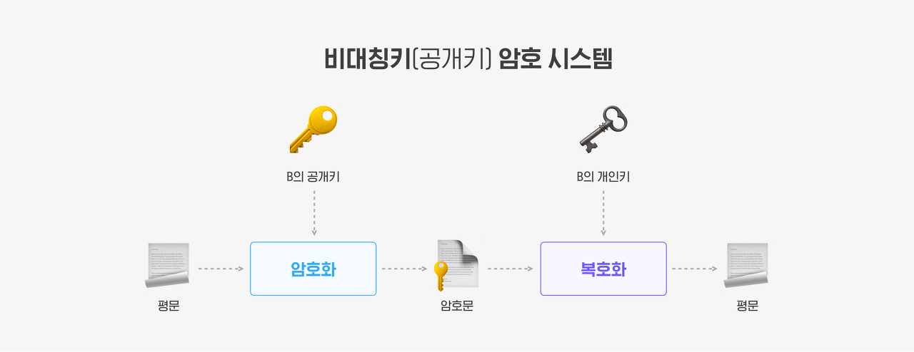

# 2022-02-24

# HTTP란 무엇인가?

<aside>
💡 HTTP(Hyper Text Transfer Protocal)이란 **서버/클라이언트** 모델을 따라 데이터를 주고 받기 위한 프로토콜.

</aside>

- 거의 모든 형태의 데이터 전송 가능(HTML, TEXT,IMAGE, 음성, 영상,JSON,XML)
- 서버간에 데이터를 주고 받을 때도 대부분 HTTP 사용
- 애플리케이션 레벨의 프로토콜로 TCP/IP 위에서 작동함.
- stateless 프로토콜
    - scale out하기에 용이
    - 단점으로는 클라이언트는 추가 데이터를 계속 전송해야 함.

# HTTP 메시지

- start line, http header, message body로 구성


## 시작 라인

요청 메시지

- start-line = **request-line** / status-line


- request-line = method SP(공백) request-target SP HTTP-version CRLF(엔터)
- HTTP 메서드 (GET: 조회)
- 요청 대상 (/search?q=hello&hl=ko)
- HTTP Version

### 요청 메시지 - HTTP 메서드

- 종류: GET, POST, PUT, DELETE...
- 서버가 수행해야 할 동작 지정
    - GET: 리소스 조회
    - POST: 요청 내역 처리

### 요청 대상(request target)

- absolute-path[?query] (절대경로[?쿼리])
- 절대경로= "/" 로 시작하는 경로  (origin 형식)
    - 참고: *, http://...?x=y 와 같이 다른 유형의 경로지정 방법도 있다. (absolute 형식)

---

### 시작라인 - 응답 메시지

- start-line = request-line / **status-line**
- **status-line** = HTTP-version SP status-code SP reason-phrase CRLF
- HTTP 버전
- HTTP 상태 코드: 요청 성공, 실패를 나타냄
    - 200: 성공
    - 400: 클라이언트 요청 오류
    - 500: 서버 내부 오류
- 이유 문구: 사람이 이해할 수 있는 짧은 상태 코드 설명 글


---

### HTTP 헤더

- header-field = field-name ":" OWS field-value OWS (OWS:띄어쓰기 허용)
- field-name은 대소문자 구문 없음


### HTTP 헤더 용도

- HTTP 전송에 필요한 모든 부가정보
• 예) 메시지 바디의 내용, 메시지 바디의 크기, 압축, 인증, 요청 클라이언트(브라우저) 정보,
서버 애플리케이션 정보, 캐시 관리 정보...
- 표준 헤더가 너무 많음
    - https://en.wikipedia.org/wiki/List_of_HTTP_header_fields
- 필요시 임의의 헤더 추가 가능
- helloworld: hihi

---

## HTTP 메시지 바디

- 실제 전송할 데이터
- HTML 문서, 이미지, 영상, JSON 등등 byte로 표현할 수 있는 모든 데이터 전송 가능


---

# HTTP Methods

| METHOD | Description |
| --- | --- |
| GET | 특정 리소스의 표시를 요청. GET을 사용하는 요청은 오직 데이터를 받기만 함. |
| HEAD | GET 메서드의 요청과 동일한 응답을 요구하지만, 응답 본문을 포함하지 않음. |
| POST | 특정 리소스에 엔티티를 제출할 때 쓰입니다. 이는 종종 서버의 상태의 변화나 부작용을 일으킴. |
| PUT | 목적 리소스 모든 현재 표시를 요청 payload로 바꿈 |
| DELETE | 특정 리소스를 삭제 |
| CONNECT | 목적 리소스로 식별되는 서버로의 터널을 맺음. |
| OPTIONS | 목적 리소스의 통신을 설정하는 데 쓰임. |
| TRACE | 목적 리소스의 경로를 따라 메시지 loop-back 테스트 |
| PATCH |  메서드는 리소스의 부분만을 수정하는 데 쓰임. |

### 메시드의 속성

- 안전(Safe Methods)
    - 서버의 상태를 바꾸지 않으면 안전
- 멱등(Idempotent Methods)
    - f(f(x)) = f(x)
    - 한 번 호출하든 두 번 호출하든 100번 호출하든 결과가 똑같다.
- 캐시가능(Cacheable Methods)
    - 응답 결과를 캐시해서 사용해도 되는가?
    - 실제로는 GET, HEAD 정도만 캐시해서 사용
        - POST, PATCH 같은 경우 메시지 바디를 캐싱해야되기 때문에 구현이 어려움.


## patch는 왜 멱등성 보장하지 않는가?

- 수정할 리소스의 일부만 담아서 보내는 경우 당연히 멱등성 보장이됨.
- 리소스를 대체하는 행위가 아니기 때문에 어떤 방식으로 사용하는지에 대한 제한이 딱히 없음.

```jsx
PATCH users/1
{
    $increase: 'age',
    value: 1,
}
```

- 위 요청의 $increase 필드의 값을 증가 시키고 싶은 속성을 의미하고, value 필드의 값은 그 속성을 얼마나 증가 시킬 것인지를 나타냄.
- 이 경우 api가 호출 될때 마다 1씩 증가하기 때문에 이 api는 멱등성을 보장하지 않음.
- 스펙 상 구현 방법에 대한 제약이 없기 때문에 이런식으로 사용해도 표준을 어기는 것은 아님.

### GET과 POST 차이

### GET

- URL에 query parameter(query string)을 통해 데이터를 요청
- 데이터의 크기가 제한적
- url에 그대로 데이터 노출

### POST

- body에 데이터가 담겨 전송
- GET 방식 보다 대량의 데이터를 담을 수 있고, 보안면에서 나음.

# HTTP와 HTTPS

## HTTP

- 평문(암호화 되지 않은) 통신이기 때문에 도청이 가능
- 통신 상태를 확인하지 않기 때문에 위장할 수 있음.
- 완전성을 증명할 수 없기 때문에 변조 할 수 있음.

## HTTPS


- HyperText Transfer Protocol Secure
- TCP 위에 SSL/TLS layer를 추가하여 암호화, 인증
    - HTTP와 독립된 프로토콜
    - SSL == TLS
    - HTTP 통신을 하는 소켓 부분을 SSL프로토콜로 대체
- 네트워크 상에 중간에 제3자가 볼수 없도록 공개키 암호화 지원
- 민감한 트래픽 (인증,전자상거래)에 이용

### 대칭키

- 암호화에 쓰이는 키와 복호화에 쓰이는 키가 동일한 기법
- 탈취의 위험이 있음.


### 공개키 (비대칭키)

- 클라이언트에서 공개키로 암호화
- 서버에서 개인키로 데이터 복호화
- 처리 알고리즘이 대칭키보다 느림.



## SSL 인증서

- SSL을 적용하기 위해 인증서
- 인증서 내용
    - 서비스의 정보(CA, 도메인 등등)
    - 서버 측의 공개키(공개키의 내용, 공개키의 암호화 방식)
- HTTPS 프로토콜 사용하기 위해 인증 기관(CA)으로 부터 SSL 발급 받아야 함.

### CA(Certificate Authority)

- SSL 인증서를 발급해주는 공인된 기관
- 인증서는 서비스의 정보(CA, 도메인 등등), 서버 측의 공개키(공개키의 내용, 공개키의 암호화 방식)가 포함되어 있음.
- 인증서를 발급 해주는 기업을 CA라 함.

## HTTPS 통신 과정 및 원리


- 대칭키와 공개키(비대칭키) 두 방식 모두 사용하는 하이브리드 암호 시스템
- 대칭키 (1개의키) 방식을 취하되, 그 키를 공유 할 때 공개키 방식을 취함.
- 탈취 위험이 있는 대칭키의 단점과 속도가 느린 공개키의 단점을 모두 보완한 방식

# REST API(Representational State Transfer)

- 자원을 URI로 표시하고, 해당 자원의 상태를 주고 받는것을 의미
- 구성 요소
    - `자원(Resource): URI`
    - `행위(Verb): HTTP METHOD`
    - `표현(Representations)`

## 특징

1. server-client  구조
    - `**REST Server**`: API를 제공하고 비지니스 로직 처리 및 저장
    - `**Client**`: 사용자 인증이나 context(세션, 로그인 정보)등을 직접 관리하고 책임짐.
2. Stateless(무상태)
    - HTTP 프로토콜은 Stateless Protocol이므로 REST 역시 무상태성을 갖습니다.
    - Client의 context를 Server에 저장하지 않음. (구현이 단순)
    - server는 각각의 요청을 완전히 별개의 것으로 인식 (서비스 자유도 높아짐)
3. Cacheable (캐시 처리 가능)
    - HTTP가 가진 가장 강력한 특징 중 하나인 **캐시 기능을 적용**할 수 있음.
    - Last-Modified Tag 또는 E-Tag를 이용해 캐싱을 구현
4. Layered system (계층 구조)
    - 다중 계층으로 구성될 수 있음.
        - 보안, 로드 밸런싱, 암호화 등을 위한 계층 추가하여 구조 변경
        - Proxy, Gateway와 같은 네트워크 기반의 중간 매체 사용 가능
        - 하지만 Client는 server와 직접 통신하는지, 중간 서버와 통신하는지 알 수 없음.
5. Uniform Interface (인터페이스 일관성)
    - URI로 지정한 Resource에 대한 요청을 통일되고, 한정적으로 수행하는 아키텍처 스타일을 의미
    - HTTP 표준 프로토콜에 따르는 모든 플랫폼에서 사용 가능, Loosely Coupling(느슨한 결함) 형태를 가짐.
        - 특정 언어나, 기술에 종속되지 않음.
6. Self-Descriptiveness (자체 표현)
- 요청 메시지만 보고 쉽게 이해할 수있음.

## 디자인 가이드

- URI는 정보의 자원을 표현해야한다 (리소스명은 동사보다는 명사)
- 자원에 대한 행위는 HTTP method로 표현
- 슬래시 **구분자(/)**는 **계층 관계**를 나타 낼때 사용
- URI 마지막 문자로 슬래시(/) 포함 하지 않음.
- **하이픈(-)**은 URI 가독성 높이는데 사용
- 밑줄(_) 은 URI에 사용하지 않음.
- URI 경로에는 소문자가 적합
- 파일 확장자를 URI에 포함 시키지 않음.

### RESTful API

- REST API 설계 가이드를 따라 API를 만드는 것

## 참고

[HTTP 요청 메서드 - HTTP | MDN](https://developer.mozilla.org/ko/docs/Web/HTTP/Methods)

[REST API 디자인 가이드](https://bcho.tistory.com/914)