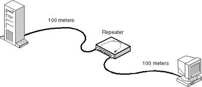
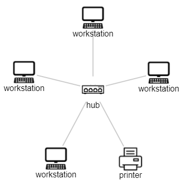
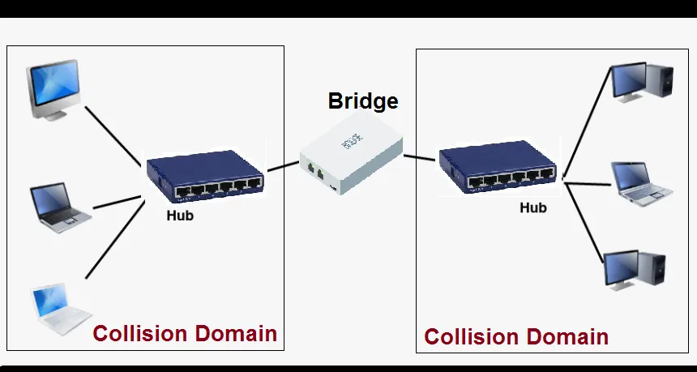
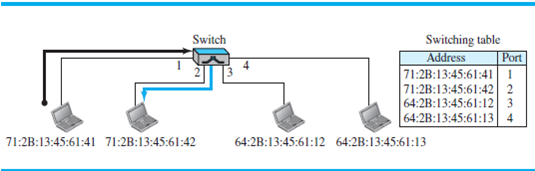

# 네트워크 장비들

## 1계층(물리 계층)

## _Repeater_

repeater는 물리 계층(OSI 1계층)에서 동작한다.

신호는 이동 거리에 따라 약해지는데, 신호가 더 먼 곳에 도달할 수 있도록 약해지기 전에 신호를 재생성하는 일을 한다.

repeater가 신호를 원래의 세기로 재생성하는 것이지 원래의 세기보다 더 크게 증폭시키지는 않는다.

포트가 2개인 장치이다.

## _Hub_

multiport repeater

허브는 데이터를 거를 수 없고 연결된 모든 장치에 데이터 패킷을 보낸다.

충돌 도메인이 하나이다.

data packet의 최적 경로를 찾을 수 없다.

## 2계층(링크 계층)

## _Bridge_

repeater와 유사하다.

repeater와 다르게 MAC 주소를 읽고 필터링하는 기능이 있다.

같은 프로토콜에서 동작하는 두 LANs을 연결하는데 사용될 수 있다.

포트가 2개인 장치이다.

## _Switch_

buffer를 가진 multiport bridge이고, 그것의 효율성과 성능을 향상시키기 위해 고안되었다.(많은 포트의 수는 적은 트래픽을 암시한다.)

데이터를 전달하기 전에 error checking을 수행한다.

에러가 있다면 전달하지 않고, 에러가 없다면 일치하는 포트에만 선택적으로 전송하기 때문에 효율적이다.

host들의 충돌 도메인을 분리하지만, broadcast domain은 동일하게 유지한다.

## 3계층(네트워크 계층)

## _Router_

switch와 유사하다.

switch는 MAC을 기준으로 데이터의 경로를 정하지만, router는 IP 주소를 기준으로 한다.

일반적으로 LANs와 WANs를 연결한다.

routing table을 동적으로 업데이트시킨다.

router는 broadcast domain을 기준으로 table을 나눈다.

## 조합?!

---

## 출처

[https://mplsnet.wordpress.com/tag/physical-layer/](https://mplsnet.wordpress.com/tag/physical-layer/)
[https://www.101computing.net/design-your-own-network/star-topology-hub/](https://www.101computing.net/design-your-own-network/star-topology-hub/)
[https://digitalthinkerhelp.com/what-is-bridge-in-networking-types-uses-functions-of-network-bridge/](https://digitalthinkerhelp.com/what-is-bridge-in-networking-types-uses-functions-of-network-bridge/)
[https://www.chegg.com/homework-help/port-switch-figure-173-need-link-layer-address-explain-figur-chapter-17-problem-8p-solution-9780073376226-exc](https://www.chegg.com/homework-help/port-switch-figure-173-need-link-layer-address-explain-figur-chapter-17-problem-8p-solution-9780073376226-exc)
[https://www.geeksforgeeks.org/network-devices-hub-repeater-bridge-switch-router-gateways/](https://www.geeksforgeeks.org/network-devices-hub-repeater-bridge-switch-router-gateways/)
