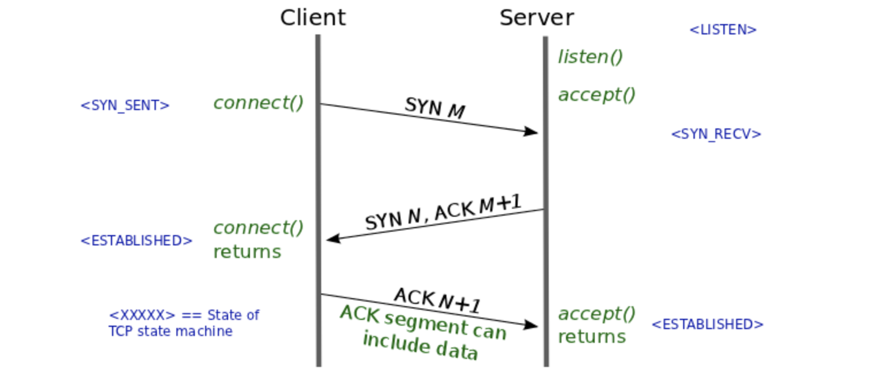

## TCP 3-way handshake vs 4-way handshake

### 3-way handshake for Connection Establishment

1. 클라이언트는 서버에 접속 요청하는 **SYN(a)** 패킷을 보낸다
2. 서버는 클라이언트의 요청인 **SYN(a)**를 받고 클라이언트의 요청을 수락한다는 ACK+SYN이 설정된 패킷 (**ACK(a+1), SYN(b)**)을 보낸다
3. 클라이언트는 서버의 수락 응답인 **ACK(a+1)과 SYN(b)** 패킷을 받고 **ACK(b+1)** 패킷을 서버로 보내면 연결이 성립된다

### 4-way handshake for Connection Termination

1. 클라이언트가 연결을 종료하겠다는 **FIN 플래그**를 전송한다
2. 서버는 클라이언트의 FIN 요청을 받고 알겠다는 확인 메시지로 **ACK**를 보낸다
    1. 그 후 관련된 데이터를 모두 보낼 때까지 잠깐 **TIME_OUT**이 된다
3. 데이터를 모두 보내고 통신이 끝났으면 연결이 종료되었다고 클라이언트에게 **FIN** 플래그를 전송한다
4. 클리언트는 **FIN** 메시지를 확인했다는 **ACK** 메시지를 보낸다
5. 클라이언트의 **ACK** 메시지를 받은 서버는 소켓 연결을 close 한다
6. 클라이언트는 아직 서버로부터 받지 못한 데이터가 있을 것을 대비해 일정 시간 동안 세션을 남겨놓고 잉여 패킷을 기다리는 과정을 거친다 (**TIME_WAIT**)

### Why 3-way, 4-way?

TCP connection = bidirectional connection

- 클라이언트가 서버에게 자신의 목소리가 들리냐고 물어보는 과정 → `SYN`
- 서버가 클리언트에게 목소리가 들린다고 말해주고 본인의 목소리도 들리냐고 불어보는 과정 → `SYN+1` , `ACK`
- 클라인트가 서버의 목소리가 들린다고 말해주는 과정 → `ACK`

✅ 최소 3-way handshake가 필요한 이유

### Why randomized sequence number?

초기 sequence number (ISN)을 난수를 생성해서 설정하는 이유는 Connection을 맺을 때 사용하는 포트를 유한 범위 내에서 사용하고 시간이 지남에 따라 재사용하기 때문이다.

서버 측에서는 패킷의 SYN을 보고 패킷을 구분하게 되는데 난수가 아닌 순차적인 number가 전송된다면 이전 connection으로부터 오는 패킷으로 인식할 수 있다.

## TCP vs UDP

> Transport 계층은 연결형 프로토콜과 비연결형 프로토콜을 가진다
> 

### UDP (User Datagram Protocol)

- 비연결형 프로토콜
- IP 데이터그램을 캡슐화하여 보내는 방법과 연결 설정을 하지 않고 보내는 방법 제공
- 흐름제어, 오류제어 또는 손상된 세그먼트의 수신에 대한 재전송을 하지 않는다
- 클라이언트가 서버로 짧은 요청을 보내고 짧은응답을 기대할 때 사용된다.
    - 만약 요청또는 응답이 손실된다면 클라이언트는 time out되고 다시 시도할 수 있으면 된다
    - TCP처럼 초기설정이 필요하지 않다

### TCP (Transmission Control Protocol)

- 연결형 프로토콜
- 신뢰성과 순차적인 전달의 필요성으로 대두된 프로토콜
- TCP 연결은 송신자와 수신자 모두가 소켓이라고 부르는 종단점을 생성함으로써 이루어진다
    - 전이중 (full-duplex), 점대점(point-to-point) 방식이다
    - **전이중 (full-duplex)** 방식은 전송이 양방향으로 동시에 일어날 수 있다는 것을 의미한다.
    - **점대점 (point-to-point)**은 각 연결이 정확히 2개의 종단점을 가지고 있다는 것을 의미한다

### TCP header vs UDP header

### 참고자료
[NAVER D2](https://d2.naver.com/helloworld/47667)