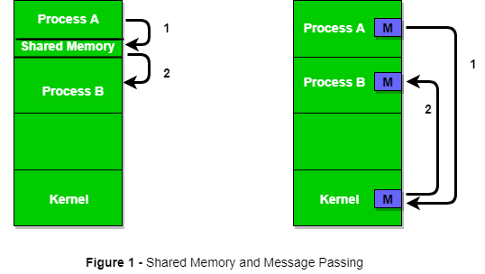

# IPC(Inter Process Communication)

프로세스들은 자신만의 공간을 가지는데 다른 프로세스의 공간에는 접근하지 못한다.

IPC에 관한 내용은 해당 사이트(https://www.geeksforgeeks.org/inter-process-communication-ipc/)를 참고하였습니다.

IPC에서 동기화(Semaphore, Mutual Exclusion 등)는 중요한 부분이지만, 추후에 다루기 때문에 여기서는 다루지 않음.

IPC는 크게 두가지 방식으로 나눌 수 있다.

-   Shared Memory 방식
-   Message Passing 방식

왼쪽이 shared memory 방식, 오른쪽이 message passing 방식. (출처 [GeeksforGeeks](https://www.geeksforgeeks.org/inter-process-communication-ipc/))

### shared memory 방식

shared memory 방식은 process 간에 공유된 공간이 존재하며 system call을 호출할 필요가 없어 kernel에 대한 의존성이 낮다. 그렇기 때문에 message passing 방식에 비해 빠르다.

shared memory 방식에는 file, shared memory, message queue가 있다.

하지만, shared memory 방식에는 Producer-Consumer Problem이 발생할 수 있다.

두 프로세스는 버퍼라고 하는 공유된 공간을 공유한다. Producer는 버퍼에 데이터를 생산하고, Consumer는 버퍼에 있는 데이터를 소비한다.

이때, 두 가지 문제가 발생한다.

첫째, 버퍼가 가득 찬 상태에서 Producer가 버퍼에 데이터를 채우는 경우.

둘째, 버퍼가 비어 있는 상태에서 Consumer가 버퍼에 데이터를 요구하는 경우.

이를 해결하기 위해서는 Producer와 Consumer는 자신들의 동작을 하기 전에 버퍼를 확인하는 과정이 필요하다. Producer는 버퍼가 가득 찼다면 버퍼가 소비될 때까지 기다린다. 반대로, Consumer는 버퍼가 비어 있다면 버퍼가 채워질 때까지 기다린다.

### message passing 방식

message passing 방식은 kernel을 거쳐서 message를 전달하게 된다. 이는 장단점이 있는데, 기존의 kernel을 활용하기 때문에 쉽게 구현할 수 있다. 반면, kernel을 거치기 때문에 속도면에서 느릴 수 있다.(user level과 kernel level이 넘나들기 때문)

message passing 방식에는 pipe, socket, RPC 등이 있다.

message passing 방식에도 문제가 발생할 수 있는데 message 전달을 동기식으로 처리할 것인지 비동기식으로 처리할 것인지 에 따라 다를 수 있다.

동기방식으로 message를 전달하게 되면 동기화에 대한 문제는 없지만, message가 전달 되는 동안 기다리기 때문에 성능에 좋지 않다.

반면, 비동기 방식은 message를 보내기만 하고 기다리지 않기 때문에 성능이 좋다. 반면, 동기화에 대한 문제가 발생할 수 있고, 비동기로 처리하기 때문에 message가 특정 버퍼에 쌓이게 되고 이는 버퍼가 가득찼을 때 문제가 발생할 수 있다.

---

### 출처

[https://talkingaboutme.tistory.com/entry/Process-Inter-Process-Communication-IPC](https://talkingaboutme.tistory.com/entry/Process-Inter-Process-Communication-IPC)

[https://en.wikipedia.org/wiki/Message_passing](https://en.wikipedia.org/wiki/Message_passing)

[https://www.geeksforgeeks.org/inter-process-communication-ipc/](https://www.geeksforgeeks.org/inter-process-communication-ipc/)
