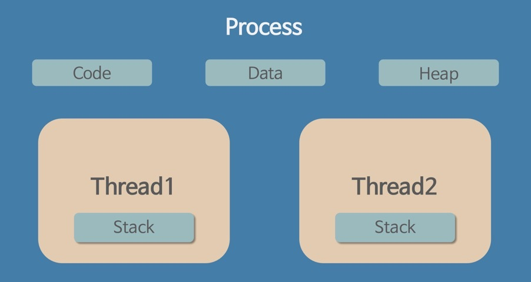
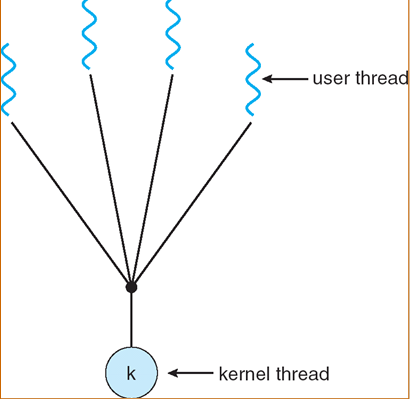
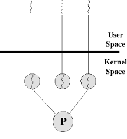
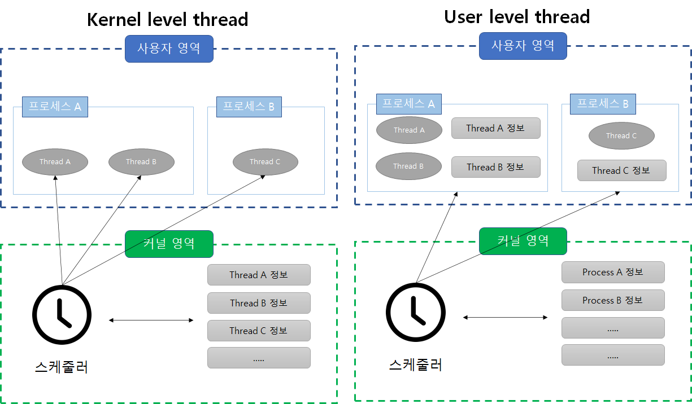
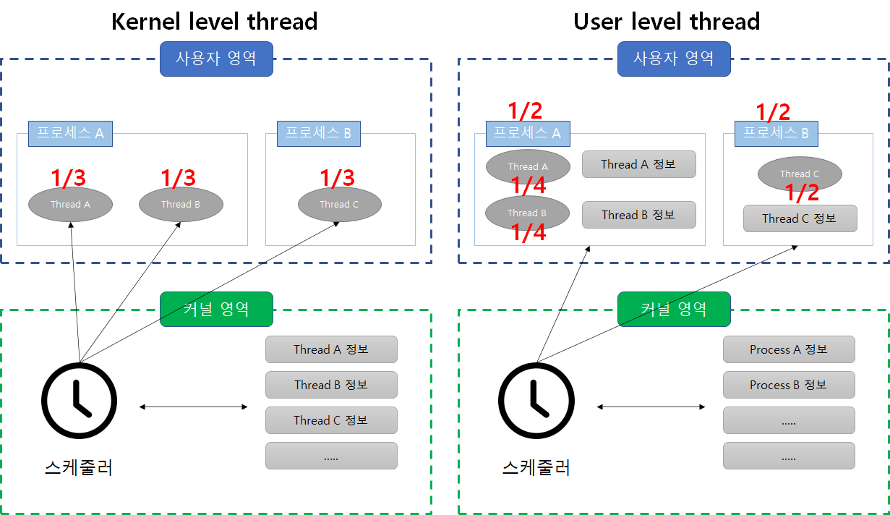
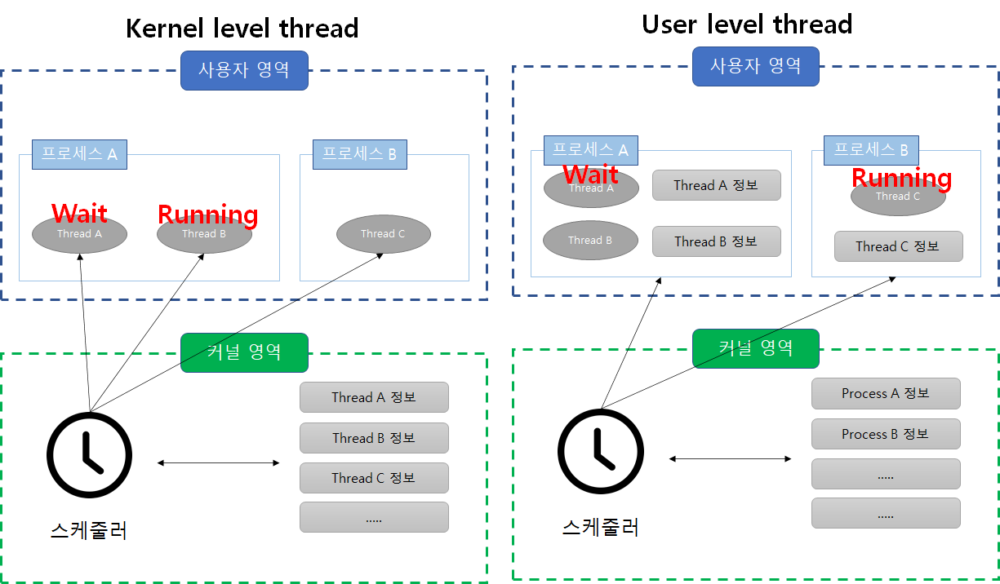

# Thread

<aside>
💡 Thread란 간단히 말해 프로세스 내에서 실행되는 실행 단위.
프로세스는 이러한 스레드를 한 개 이상을 가질 수 있음.

</aside>

- 스레드는 별도의 stack(스레드 실행 환경 정보, 지역 데이터, 레지스터 등)을 할당 받고, Code, Data, Heap 영역은 같은 프로세스 내의 다른 스레드와 공유 함.

프로세스 하나에 포함 스레드들의 공동의 목적을 달성하려고 병렬ㄹ로 수행함. 이러한 스레드를 이용하면 아래와 같은 이점들이 있음.

- 사용자 응답성 증가
- 프로세스 자원과 메모리 공유 가능
- 경제성이 좋음(프로세스 컨텍스트 스위칭보다 스레드 컨텍스트 스위칭이 오버헤드가 더 적음)
- 다중 처리로 성능과 효율 향상

## Thread

- 현대 시스템은 대부분 다중 스레드 운영체제임.
- 다중 스레드는 프로그램 하나를 여러 실행 단위로 쪼개어 실행 한다는 측면에서 다중 처리(다중 프로세싱)와 의미가 비슷함.
  - 하지만 동일 프로세스의 쓰레드는 자원을 공유 하므로 자원 생성과 관리의 중복성을 최소화하여 실행 능력을 향상 시킬 수 있음.
- 각 스레드는 커널이 개입하지 않고도, 독립적으로 실행할 수 있어 서버에서 많은 요청을 효과적으로 처리할 수 있음?
- 이러한 프로세스 보다 스레드를 생성하는 것이 더 빠르고, 동일한 프로세스에 있는 스레드간의 교환이나 스레드 종료도 훨씬 빠름.
  - 프로세스를 생성하면 해당 프로세스의 스레드도 함께 생성됨.
  - 단, 스레드 생성에는 운영체제가 부모 프로세스와 공유할 자원을 초기화 할 필요가 없음. (해당 프로세스가 스택과 레지스터를 직접 제공하기 때문)
  - 스레드 한개가 대기 상태로 변할 때, 전체 프로세스를 대기 상태로 바꾸지 않는 다는 것
    - 실행 상태의 스레드가 대기 상태가 되면 다른 스레드를 실행할 수 있음.

## TCB( Thread-control-block)

프로세스가 PCB에 정보를 저장하듯, 스레드도 TCB에 정보를 저장한다.

그런데 프로세스는 스레드를 한 개 이상 가질 수 있으므로, 결국 PCB는 TCB list 를 가리킨다.

# **User level thread 와 Kernel level thread**

1. User level thread - 다대일 매핑
2. Kernel level thread - 일대일 매핑

### User level thread

- **사용자 영역**의 **스레드 라이브러리**로 구현
- 스레드와 관련된 모든 행위를 사용자 영역에서 하므로 **커널이 스레드의 존재**를 **알지 못함**.
  - 커널은 스레드가 아닌 프로세스를 한단위로 인식
- 다수의 사용자 스레드가 커널 스레드 한개에 매핑 되므로 다대일 스레드 매핑

## kernel level thread

- **커널**이 **스레드**와 관련된 모든 작업을 **관리**함.

- **한 프로세스**에서 **다수의 스레드**가 프로세서를 할당 받아 **병행**으로 수행

  - 스레드 한개가 대기 상태가 되면 동일한 프로세스에 속한 다른 스레드로 교환이 가능

- 커널 수준 스레드는 사용자 스레드와 커널 스레드가 일대일로 매핑

- 그림 설명

  

  ## 프로세스,스레드 우선 순위가 동등한 경우

  

  - 커널 레벨 스레드의 경우 스레드를 커널에서 직접 관리 하기 때문에 스레드의 실행 시간을 1/3씩 배분하여 할당

  - 사용자 레벨 스레드의 경우 커널은 스레드를 인식하지 못하고, 단순히 프로세스 관리만 함.

    - 실행 시간을 프로세스 기준으로 1/2 씩 할당 하고, 프로 세스안에서 스레드가 실행 시간을 배분하게 됨.

      → 따라서 thread A,B는 1/4, Thread c는 1/2 씩 실행 시간을 배분 받게됨.

  ## Thread A가 I/O 이벤트로 wait 상태의 경우

  

  - 커널 레벨에서는 thread A가 대기 상태의 경우 Thread B나 C에게 제어권을 넘겨줌.
  - 사용자 레벨에서는 Thread B에 실행권을 넘겨주지 못해, 프로세스 A가 대기 상태이므로 프로세스 B에게 실행권을 넘겨주게 됨.
    - 프로세스 단위로 실행을 관리
    - 스레드 A가 실행 불가능한 상태로 빠졌다는 이유로 스레드 B도 실행을 못하게 됨...

# user level,kernel level thread 장단점

## User Level

- 이식성 높음
  - 커널에 독립적으로 스케줄링을 할 수 있어 모든 운영체제에 적용할 수 있음.
- 오버헤드가 적음.
  - 스케줄링이나 동기화를 하려고 커널을 호출하지 않으므로 커널 영역으로 전환하는 오버헤드가 줄어듬.
- 유연한 스케줄링이 가능
  - 커널이 아닌 스레드 라이브러리에서 스레드 스케줄링을 제어 하므로 응용 프로그램에 맞게 스케줄링 할 수 있음.
- 시스템의 동시성을 지원하지 않음.
  - 동일한 프로세스의 스레드 한개가 대기 상태가 되면 이 중 어떤 스레드도 실행하지 못함.

## Kernel Level

- 커널이 각 스레드 개별적으로 관리할 수 있음.
- 동작중인 스레드가 wait 되도 해당 프로세스 내 다른 스레드가 계속 실행 될 수 있으
- 커널 영역으로 전환하는 오버헤드가 발생하고, 스케줄링과 동기화를 하려면 더 많은 자원이 필요

[운영체제 - 쓰레드란?(Thread,사용자 수준 쓰레드, 커널 수준 쓰레드, 혼합형 쓰레드)](https://coding-start.tistory.com/199)

[개발자 기술면접 #1 - 운영체제](https://ohcode.tistory.com/2)