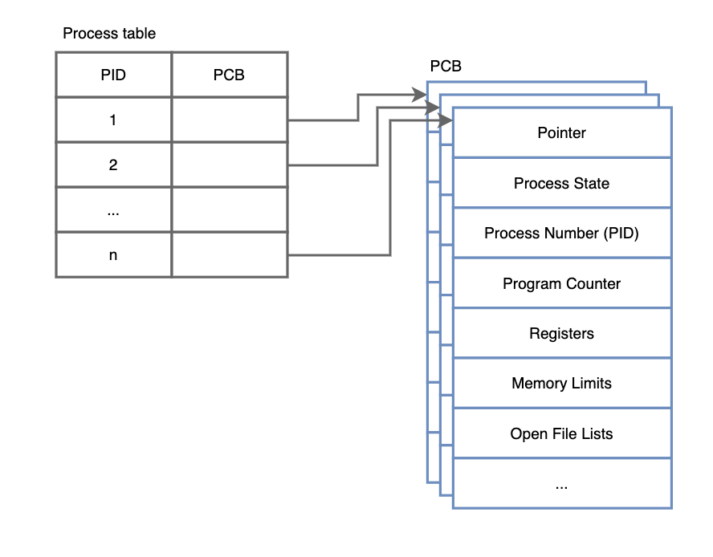
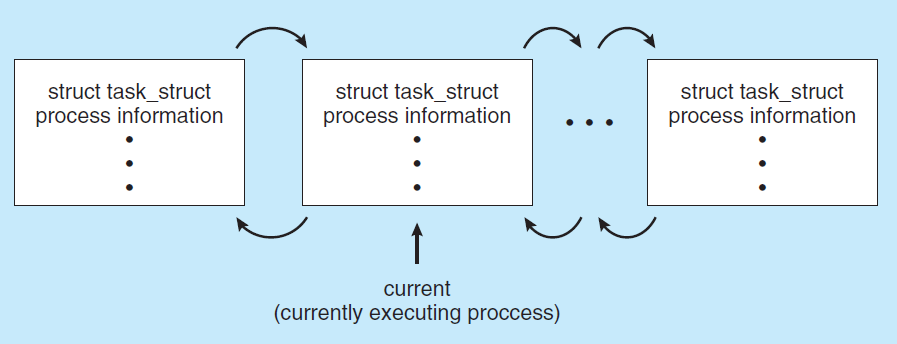
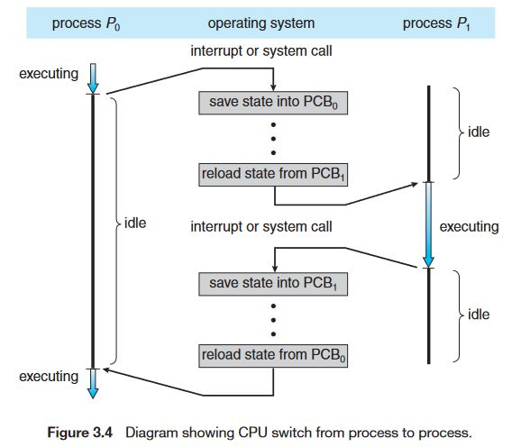

# Process Management

<aside>
💡 구동중인 프로세스가 여러 개일 때, **CPU 스케줄링을 통해 프로세스를 관리하는 것**을 의미한다. 당연하게도, CPU 들은 각 프로세스들에 대해서 구분할 수 있어야 관리가 가능하다. 
따라서 **각기다른 프로세스들의 본연의 특징을 갖고 있는 `Process Metadata` 라는 정보를 활용**한다.

</aside>

메타 데이터는 프로세스가 생성 될 때마다 PCB (Process  Control Block)이라는 곳에 저장된다.

## PCB (Process Control Block)

<aside>
💡 CPU가 프로세스를 제어하기 위해 정보를 저장해 놓는 곳으로, 프로세스의 상태 정보를 저장하는 구조체

</aside>

### process in linux

kernel source code `<linux/sched.h>` 파일에 있는 `task_struct` 로 PCB를 표현

## PCB 구성 요소

- **Process ID(PID)**: 각 프로세스를 다른 모든 프로세스로 부터 구별하게 해주는 유일한 식별자
- **Process State (프로세스 상태)** :프로세스가 현재 수행 중이면, 그 프로세스는 **수행(Running) 상태**에 있음. (New, Ready, Running, Wait, Terminated)
- **Process Priority (스케줄링 정보)**: 다른 프로세스들에 대해 상대적인 우선순위 정보
- **Program Counter**: 다음 실행할 명령어의 주소
- **CPU registers**: 여러 범용 목적의 레지스터들(accumulator, index register, stack pointers, general purpose registers)
- **memory-management information** : 페이지 테이블, 세그먼트 테이블 대한 정보
- **Accounting information** : CPU 사용 시간, 실제 사용된 시간, 시간 제한
- **I/O status information**: 프로세스에 할당된 I/O 기기에 해당하는 정보, 열린 파일 목록

# Context switching

<aside>
💡 CPU가 이전의 프로세스 상태를 PCB에 보관하고, 또 다른 프로세스의 정보를 PCB에서 읽어서 레지스터에 적재하는 과정

</aside>

### **Context Switching이 왜 필요한가?**

- CPU가 매번 하나의 Task만 처리할 수 있다면 반응 속도가 매우 느리다.
- Task를 바꿔가며(멀티 태스킹) 실행하며 **병렬적으로 동시에** 처리 할 수 있다.(엄밀히 말하자면 동시에 처리가 되지는 않지만 빠른 속도의 **context switching**으로 병렬적으로 처리 되는 것처럼 보임)
- I/O가 발생 시 끝날 때까지 기다린다면 **CPU가 낭비된다**. 때문에 다른 프로세스로 제어권을 넘겨 CPU를 더 사용하는게 이익이다.

**Context Switching 시나리오**

1. P0 프로세스가 인터럽트되면서 PCB0에 P0 프로세스의 상태 정보를 저장합니다.
2. 다음 수행할 P1 프로세스의 PCB1에서 P1 프로세스의 상태 정보가 CPU에 재로딩됩니다.
3. P1 프로세스를 일정 시간 수행합니다.
4. P1 프로세스가 인터럽트되면서 PCB1에 P1 프로세스의 상태 정보를 저장합니다.
5. 다음 수행할 P0 프로세스의 PCB0에서 P0 프로세스의 상태 정보가 CPU에 재로딩됩니다.
6. P0 프로세스를 일정 시간 수행합니다.

## Context Switching의 오버 헤드(overhead)

- Context Switching 진행하는 동안 CPU는 다른 작업을 진행할 수 없으므로, Context switching 시간은 오버헤드라고 볼 수 있음. (Cache 초기화, 메모리 매핑 초기화)
- 잦은 context switching은 성능 저하!
- overhead를 감수하면서 기존 프로세스를 새 프로세스로 바꾸는 것이 더 낫다!
- 시간 할당량이 적어지면 : Context Switching 수, 오버헤드가 증가하지만 여러 개의 프로세스가 동시에 수행되는 느낌을 갖는다.
- 시간 할당량이 커지면 : Context Switching 수, 오버헤드가 감소하지만 여러 개의 프로세스가 동시에 수행되는 느낌을 갖지 못한다.

### Context switching 발생 시기

1. I/O request (입출력 요청시)
2. time slice expired (CPU 사용 시간이 만료 되었을때)
3. fork a a child (자식 프로세스 생성 시)
4. wait for an interrupt (인터럽트 처리를 기다릴 때)

## process vs thread

Context Switching 비용은 Process가 Thread 보다 많이 듬.

Thread는 Stack 영역을 제외한 모든 메모리를 공유하기 때문에, Context Switching 시 Stack 영역만 변경 하면 됨.

---

[[OS/운영체제] PCB와 Context switching](https://velog.io/@yanghl98/OS%EC%9A%B4%EC%98%81%EC%B2%B4%EC%A0%9C-PCB%EC%99%80-Context-switching)

[운영체제 - 교보문고](http://www.kyobobook.co.kr/product/detailViewKor.laf?mallGb=KOR&ejkGb=KOR&barcode=9788998886813)

[Process Table and Process Control Block (PCB) - GeeksforGeeks](https://www.geeksforgeeks.org/process-table-and-process-control-block-pcb/)