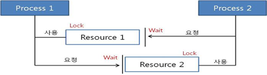

# Thread safety

wiki 참고

<aside>
💡 멀티 스레드 프로그래밍에서 일반적으로 어떤 함수나 변수, 혹은 객체가 여러 스레드로 부터 동시에 접근이 이루어져도 프로그램의 실행에 문제가 없음을 뜻한다.
즉, 하나의 함수가 한 스레드로부터 호출되어 실행 중일 때, 다른 스레드가 그 함수를 호출하여 동시에 함께 실행 되더라도 각 스레드에서의 함수의 수행 결과가 올바로 나오는 것으로 정의

</aside>



```python
a = 3
b = 2
print(a + b)
```

이와 같이 간단한 연산의 경우, 여러 스레드가 동시에 처리하더라도 thread-safety 하게 처리 될 수 있음.

```python
d[key] + value
d[key] = value
```

위의 코드는 thread-safety 하지 않음. 조회와 대입 사이에 스레드 전환이 일어날 수 있기 때문.

스택 영역

# Thread-safety 지키기 위한 방법

1. Re-entrancy

   - 어떤 함수가 한 스레드에 의해 호출되어 실행 중일 때, 다른 스레드가 그 함수를 호출하더라도 그 결과가 각각에게 올바로 주어져야 함.
   - 스레드끼리 독립적일 수 있게 코드를 조심히 짜라!

2. Thread-local storage

   - 공유 자원의 사용을 최대한 줄여 각각의 스레드에서만 접근 가능한 저장소 들을 사용함으로써 동시 접근을 막음.
   - 이 방식은 동기화 방법과 관련되어 있고, 또한 공유 상태를 피할 수 없을때 사용하는 방식
   - 글로별 변수 등의 사용을 지양해라!

3. Mutual exclusion

   - 공유 자원을 꼭 사용해야 할 경우 해당 자원의 접근을 세마포어, lock 등으로 통제

4. Atomic operations

   - 공유 자원에 접근할 때 원자 연산을 이용하거나 ‘원자적’으로 정의된 접근 방법을 사용함으로 써 상호 배제를 구현할 수 있음.
     - `+=` 연산의 경우 한 줄의 코드더라도 `+` 연산 후에 `=` 연산을 하기 때문에 원자 적이라고 하기 어려움.(virtual instruction 수준에서 보더라도 원자적이라고 보기 어려움.)
   - atomic 하다는 것은 멀티 스레드 환경에서 데이터가 반드시 변경 전과 후의 상황에서만 접근하는 것을 보장. 즉, 데이터의 변경이 이루어지고 있는 순간에는 접근이 불가능.

5. Immutable Object

   객체 생성 이후에 값을 변경 할 수 없도록 만듬.

## Thread-safety Data Types

java 라이브러리에는 몇몇 Thread-safe인 데이터 유형이 있음.

> [StringBuffer is] A thread-safe, mutable sequence of characters. A string buffer is like a String, but can be modified. At any point in time it contains some particular sequence of characters, but the length and content of the sequence can be changed through certain method calls.
>
>
> String buffers are **safe for use by multiple threads.** The methods are **synchronized** where necessary so that all the operations on any particular instance behave as if they occur in some serial order that is consistent with the order of the method calls made by each of the individual threads involved.

> [StringBuilder is] A mutable sequence of characters. This class provides an API compatible with StringBuffer, but with no guarantee of synchronization. This class is designed for use as a drop-in replacement for StringBuffer in places where the string buffer was being used by a single thread (as is generally the case). Where possible, it is recommended that this class be used in preference to StringBuffer as it will be faster under most implementations.

### 요약하자면,

`StringBuffer`는 멀티 스레드 환경에서 사용하기 좋으며, 동기화가 되기 때문에 thread-safe하다. 그러나 `StringBuilder` 는 싱글 스레드 환경에서 사용될 수 있으며 동기화가 이루어지지 않는다. 

여기서 Thread-safe Data Type은 `StringBuffer` 라고 할 수 있겠다.

`Vector`와 `Hashtable`을 제외한 Java Collection Interface 대부분은 싱글 스레드 환경에서 사용할 수 있도록 설계되어있어 `List`, `Set`, `Map`, `ArrayList`, `HashSet`, `HashMap` 등은 thread-safe하지 않다.

멀티 스레딩 환경을 위해 자바에서는 `Collections.synchronizedXXX()` 메소드를 제공한다.

```java
List<String> list = Collections.synchronizedList(new ArrayList<String>()); 
private static Map<Integer,Boolean> cache 
								= Collections.synchronizedMap(new HashMap<>());
```

- 위와 같이 선언하면 thread-safe한 리스트를 만들 수 있음.

- 동기화된 Collection은 스레드 작업 시 lock이 걸리기 때문에 스레드가 병렬적으로 요소들을 처리 할 수 없음.

- 이 부분 개선하기 위해 `java.util.concurrent` 패키지에서 부분 lock을 사용하는 ConcurrentXXX 가 제공됨.

  ```java
  Map<K,V> map = new ConcurrentHashMap<K,V>(); 
  Queue<E> queue = new ConcurrentQueue<E>();
  ```

  - `ConcurrentHashMap`은 읽기 작업에는 여러 스레드가 동시에 접근할 수 있지만, 쓰기 작업에는 특정 세그먼트 or 버킷에 대한 lock을 사용함.
    - 데이터를 적절히 세그먼트로 나누어 lock을 할당.
    - 같은 세그먼트만 아니라면 lock을 기다릴 필요가 없음.
    - 여러 스레드에서 `ConcurrentHashMap` 객체에 동시에 데이터를 삽입, 참조하더라도 그 데이터가 다른 세그먼트에 위치하면 서로 lock을 얻기 위해 경쟁하지 않음.

[[운영체제] 스레드 안전 : Thread-safety (C++과 JAVA)](https://eun-jeong.tistory.com/21)

[Reading 20: Thread Safety](http://web.mit.edu/6.005/www/fa15/classes/20-thread-safety/)

[HashMap, Hashtable, ConcurrentHashMap 동기화 처리 방식](https://tomining.tistory.com/169)