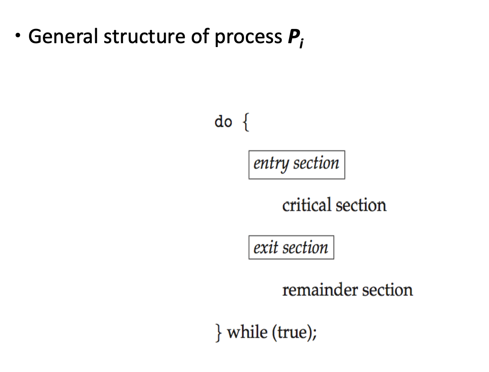
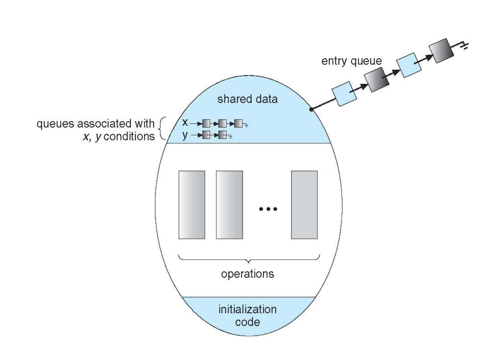
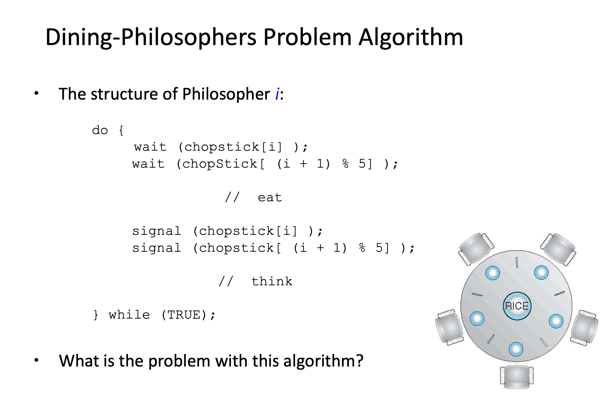
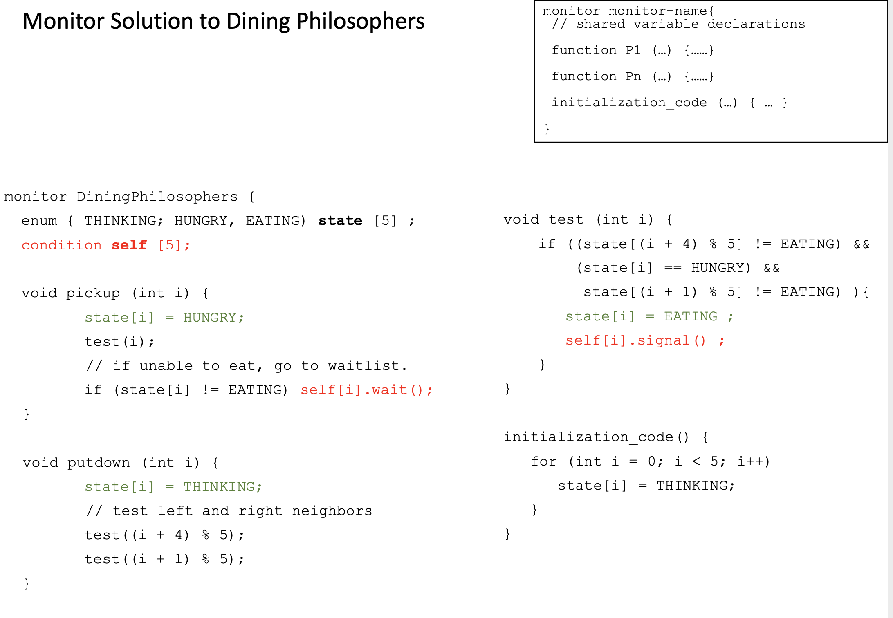
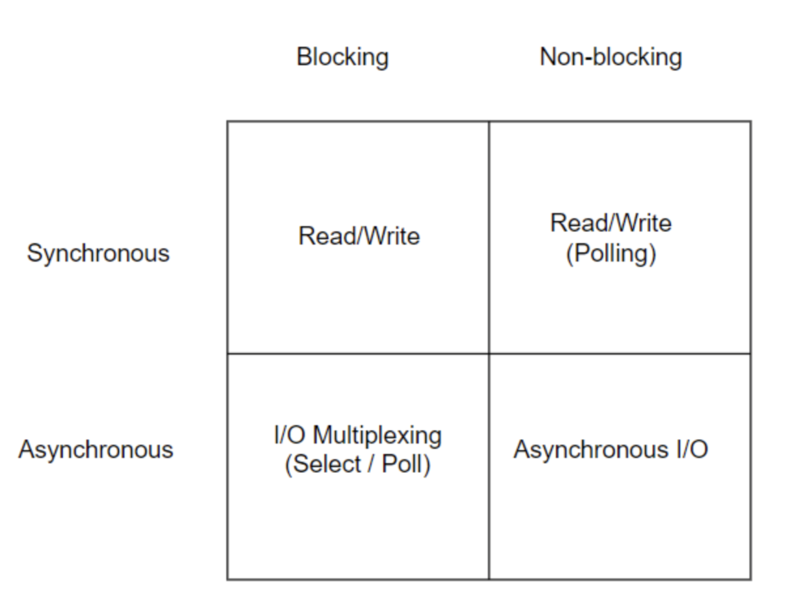
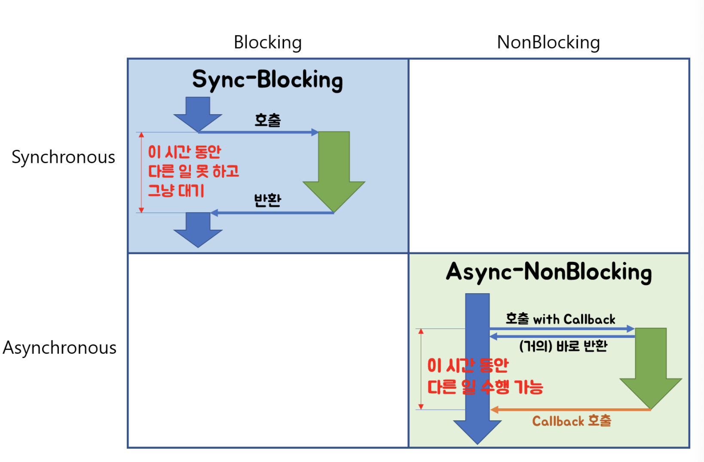
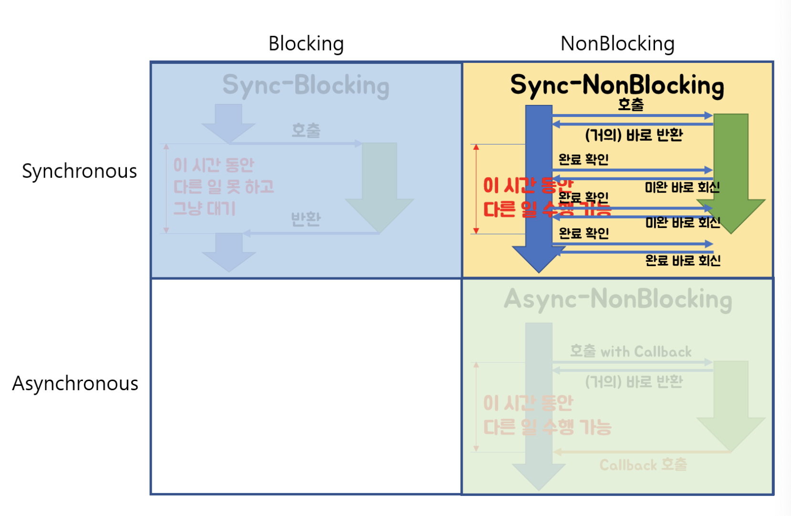
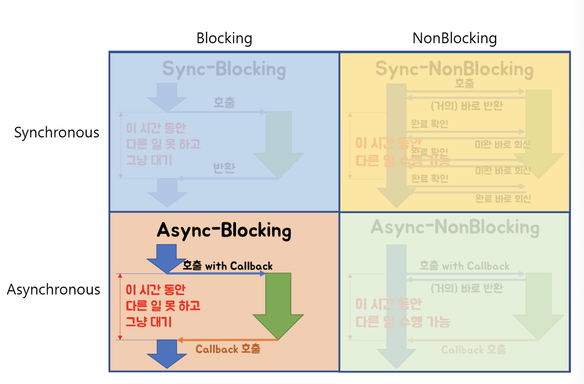

## Critical Section Problem

> ***Critical Section Problem is to design a protocol that the processes can use to cooperate***
> 

### Critical Section이란?

- 글로벌 변수 변경, 파일 읽고 쓰기 등의 작업
- 한 프로세스가 **critical section**에 있다면 다른 프로세스는 출입 금지 🚫



**entry section 👉🏻 프로세스가 critcial section에 들어갈 수 있는지 허락 요청을 보내는 섹션**

**exit section 👉🏻 프로세스가 critical section을 빠져나가는 섹션**

### Critical Section Problem의 해결책은 없는거니?

- **Mutual Exclusion**
    - 한 프로세스가 critical section 상에 존재한다면 다른 프로세스들은 critical section에 출입 금지
- **Progress**
    - critical section 상에 프로세스가 존재하지 않는 상태에서 critical section에 들어가고 싶어하는 프로세스가 존재한다면 critical section에 들여보내주어야 한다
    - critical section에 들어가고 싶어하는 프로세스가 무한정으로 기다리게 해서는 안된다 ⏳
- **Bounded Waiting**
    - 한 프로세스가 자신의 차례가 올 때까지 critical section에 들어가는 것을 다른 프로세스들에게 양보하는 횟수가 한정되어야 한다

### Hardware 기반의 Critical Section Problem 해결책

- `locking`을 이용해 critical section code를 보호하는 방법
- `atomic`한 hardware instructions을 사용
    - `atomic` = non-interruptible

```c
do{
	// acquire lock
		critical section
	// release lock
		remainder section
} while (true);
```

### Software 기반의 Critical Section Problem 해결책

- Hardware-based solution은 application programmer들에게 접근 권한이 없기 때문에 OS 디자이너들이 critical section problem을 해결할 수 있는 software tool을 만들어줌
    - 1️⃣ **Mutex Lock**
    - 2️⃣ **Semaphores**
    - 3️⃣ **Monitors**
    

## Mutex Lock

- `mutual exclusion` 조건을 충족하기 위해 `locking` 사용
    - *“acquire”*, *“release”*  2개의 atomic operations
- Boolean variable을 사용하여 locking 구현 👉🏻 **busy waiting** == **spinlocks**

```c
acquire() {
	while (!available); // busy-waiting
	available = false;
}

release() {
	available = true;
}

do {
	acquire();
		// critical section
	release();
		// remainder section
} while (true);
```

## Semaphores

- “wait”, “signal” 2개의 atomic operations로만 공유 자원에 접근 가능
- Semaphore 사용법
    - **Binary Semaphore - 0, 1 불리언 값만을 사용한 mutex lock과 동일하게 동작**
    - **Counting Semaphore - 공유 자원의 인스턴스 개수 만큼의 integer value range를 가짐**
    

**Binary Semaphore**

```c
wait(S) {
	while (S <= 0); // busy-waiting
	S--;
}

signal(S) {
	S++;
}
```

**Counting Semaphore**

```c
typedef struct {
	int value;
	struct process *list;
} semaphore;

wait(semaphore *S) {
	S->value--;
	if (S->value < 0) {
		block(); // add this process to S->list
	}
}

signal(semaphore *S) {
	S->value++;
	if (S->value <= 0) {
		wakeup(P); // remove a process P from S->list
	}
}
	
```

- `block` 👉🏻 프로세스를 waiting queue로 보내기
- `wakeup` 👉🏻 waiting queue에 있는 프로세스 중 하나를 ready queue로 옮기기

### Busy-wait vs Block-wakeup

> *어떤 방식이 더 좋은걸까?*
> 
- 일반적으로 CPU 소모를 줄일 수 있는 Block-Wakeup 방식이 더 좋다
- 그러나 Block-Wakeup 방식에는 overhead가 존재한다
    - 어떤 Block Process를 wakeup 하는 과정에서 ready queue로 배치하는 과정, 반대로 block 과정에서 waiting queue로 배치하는 과정 이 모든 과정들이 overhead다

👉🏻 따라서 critical section 길이가 길면 Block-wakeup을 짧으면 Busy-wait 방식이 적당하다고 볼 수 있다

### Semaphore가 가지는 문제점

- **P, Q 프로세스 Deadlock 발생**
    
    ```c
    // Process P
    wait(S);
    wait(Q);
    
    signal(S);
    signal(Q);
    
    // Process Q
    wait(Q);
    wait(S);
    
    signal(Q);
    signal(S);
    ```
    
    - **wait(mutex) ... wait(mutex)**
    - **signal(mutex) ... wait(mutex)**
- **Starvation (= indefinite blocking)**
    - 프로세스가 semaphore queue에 suspended되어 빠져나오지 못하는 상황
    

## Monitors



```c
monitor sharedCounter {
	int counter; // 공유 자원의 상태를 나타내는 private variable
	function add() { counter++; } // 공유 자원을 조작할 수 있는 메서드 1
	function sub() { counter--; } // 공유 자원을 조작할 수 있는 메서드 2
	init() { counter = 0; } // private variable들을 init할 수 있는 init code
}
```

### Monitor 등장 배경

> ***동시 수행 중인 프로세스 사이에서 abstract data type의 안전 공유를 보장하기 위한 high-level synchronization construct***
> 

- 공유 자원 데이터 (=condition variable)
    - condition x
- monitor 내부에는 공유 데이터를 접근하는 코드를 가지고 있다
    - `x.wait()` - x.wait()을 invoke 한 프로세스는 다른 프로세스가 x.signal()을 invoke하기 전까지는 대기 상태가 됨
    - `x.signal()` - 대기 상태인 프로세스 중 하나를 resume한다 (만약 대기 상태 중인 프로세스가 없다면 아무런 일도 일어나지 않는다)
- monitor에서는 한번에 하나의 프로세스만 active 상태로 동작 가능
- 프로그래머가 synchronization을 위해 lock을 걸어놓을 필요가 없다
    - 만약 프로세스 실행 도중 CPU를 빼앗겨도 실행 중이던 프로세스는 monitor 내부에 active 상태로 남아 있게 된다
    - 다른 프로세스들을은 monitor 내의 코드를 실행하지 못하고 밖의 큐에 줄서게 되고 monitor 내부에 active한 프로세스가 0이 될 때 순차적으로 밖에서 기다리던 프로세스가 들어오게 된다
- 프로세스가 monitor 안에서 기다릴 수 있게 하기 위해 condition variable을 사용
    - condition variable은 `wait()` , `signal()` 코드를 통해서만 접근 가능

### Semaphore의 Block-wakeup vs Monitor의 wait-signal

- 한 프로세스가 Sleep하려고 하고 다른 프로세스가 Sleep 하려고 하는 이 프로세스를 WakeUp하려고 하면 Sleep, WakeUp 동작은 동시 실행이 불가능
- Monitor의 wait-signal의 경우 Monitor 자체적으로 상호 배제가 이루어지기 때문에 Semaphore보다 훨씬 간편하다고 볼 수 있다

### Classical Syncrhonization Problems

1. Bounded Buffer Problem
2. Reader-Writer Problem
3. Dining Philosopher Problem





## 동기 vs 비동기, Blocking vs Non-Blocking

### Blocking vs Non-Blocking

> ***호출되는 함수가 바로 return하느냐 마느냐***
> 
- 호출된 함수가 바로 return해서 호출한 함수에게 제어권을 넘겨주고 호출한 함수가 다른 일을 할 수 있는 기회를 준다면 **non-blocking**
- 호출된 함수가 자신의 작업을 모두 마칠 때까지 호출한 함수에게 제어권을 넘겨주지 않고 대기하게 만든다면 **blocking**

### 동기 vs 비동기

> ***호출되는 함수의 작업 완료 여부를 누가 신경쓰느냐***
> 
- 호출하는 함수가 호출되는 함수의 작업 완료 후 return 값을 기다리거나 return 값을 받더라도 호출하는 함수 스스로가 작업 완료 여부를 계속 신경쓴다면 **동기**
- 호출하는 함수가 호출되는 함수에게 callback을 전달해서 호출되는 함수의 작업이 완료되면 호출되는 함수가 전달받은 callback을 실행하고 호출한 함수는 함수의 작업 완료 여부를 신경쓰지 않는다면 **비동기**









## 참고자료

[[https://velog.io/@youngminss/OS-프로세스-동기화2](https://velog.io/@youngminss/OS-%ED%94%84%EB%A1%9C%EC%84%B8%EC%8A%A4-%EB%8F%99%EA%B8%B0%ED%99%942)[](https://velog.io/@wonhee010/%EB%8F%99%EA%B8%B0vs%EB%B9%84%EB%8F%99%EA%B8%B0-feat.-blocking-vs-non-blocking)](https://velog.io/@youngminss/OS-%ED%94%84%EB%A1%9C%EC%84%B8%EC%8A%A4-%EB%8F%99%EA%B8%B0%ED%99%942)

[[https://velog.io/@wonhee010/동기vs비동기-feat.-blocking-vs-non-blocking](https://velog.io/@wonhee010/%EB%8F%99%EA%B8%B0vs%EB%B9%84%EB%8F%99%EA%B8%B0-feat.-blocking-vs-non-blocking)[](https://www.youtube.com/watch?v=IdpkfygWIMk)](https://velog.io/@wonhee010/%EB%8F%99%EA%B8%B0vs%EB%B9%84%EB%8F%99%EA%B8%B0-feat.-blocking-vs-non-blocking)

[https://www.youtube.com/watch?v=IdpkfygWIMk](https://www.youtube.com/watch?v=IdpkfygWIMk)