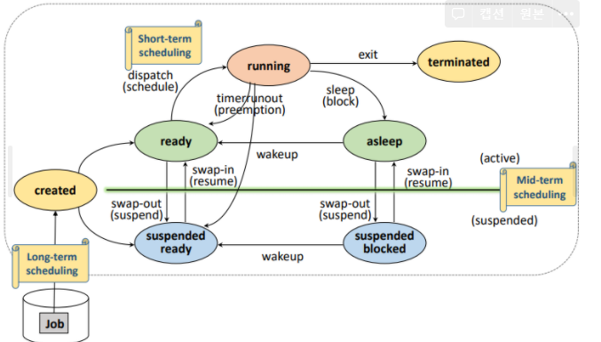

## 프로세스 스케줄링

프로세서는 한 시점에 하나의 프로세스에만 할당이 가능하다. 프로세서를 할당할 프로세스를 선정하는 방법은 시스템의 성능 지표에 따라 다르다. 주요 성능 지표는 평균 응답 시간, 처리량 등이 있다.

- 평균 응답시간 : 얼마 빨리 반응하는지
- 처리량 : 단위 시간 동안 처리한 프로세스의 수

## 스케줄링 용어

스케줄링을 이해하기 위해 아래 용어에 익숙해지자.

- 대기시간 : 프로세스 도착 후 실행 까지 시간
- 실행시간 : 프로세스 실행 후 종료까지 시간
- 반환시간 : 프로세스 도착 후 종료까지 시간
- 응답시간 : 프로세스 실행 후 첫 번쨰 출력까지 시간

## 스케줄링 단계

스케줄링이 **발생하는 빈도, 할당 되는 자원의 종류**에 따라 **장기, 중기, 단기** 스케줄링으로 구분된다.

## 장기 스케줄링(Job scheduling)

메모리를 할당하여 프로세스가 될 Job을 결정하는 단계이다. 주요 고려사항은 아래와 같다.

- I/O bounded와 Computed bounded 프로세스 적절히 선택 (병목 방지)
- 시스템 내 프로세스 수 조절(과부하 방지 → 자원 점유를 위한 경쟁 과열 방지)

## 중기 스케줄링(Memory allocation)

swap device에 존재하는 프로세스에 메모리를 할당하여 ready 상태로 변경 할 프로세스를 결정하는 단계이다.

## 단기 스케줄링(Process schedulling)

가장 자주 발생하는 스케줄링으로, ready queue에 존재하는 프로세스 중 프로세서를 할당하여 running 상태로 변경 할 프로세스를 결정하는 단계이다.

## 프로세스 상태와 스케줄링

## 프로세스 스케줄링 알고리즘

프로세스 스케줄링은 단기 스케줄링에 해당하며, 크게 **선점, 비선점**으로 구분할 수 있다.

1. 비선점 스케줄링
   - 할당 받은 자원을 종료 전 까지 반납하지 않음
   - 문맥 교환의 오버헤드가 적지만, 대기시간이 길어질 수 있음

2. 선점 스케줄링
   - 할당 받은 자원을 종료 전에 반납될 수 있음
   - 문맥 교환의 오버헤드가 있지만, 실시간 응답성, 시분할 시스템에 적합

## 비선점 스케줄링 알고리즘

### FCFS(First Come First Service) 
- 우선순위 : 도착시간이 빠를 수록
- 특징
  - 중요한 프로세스가 늦게 도착해서, 대기시간이 길어지는 문제 
  

### SRN(Shortest Process Next) = SJF(Shortest Job First)
- 우선순위 : 실행시간이 적을 수록
- 특징
  - 실행 시간을 정확히 측정하는 것은 비현실적 
  - 실행 시간이 긴 경우 무한 대기하는 기아현상 발생 

### HRRN(High Response Ratio Next)
- 우선순위 : Response Ratio가 높을 수록
  - Reponse ratio = (대기시간 + 실행시간) / 실행시간
- 특징
  - 프로세스의 대기 시간을 고려하여 정규화하여 실행시간이 적으면서 대기시간이 긴 경우를 보상 
  - 실행 시간 측정의 어려움 
  - 기아 현상 방지 가능

## 선점 스케줄링 알고리즘

### RR(Round-Robin) 
- 우선순위 : 도착시간이 빠를 수록
- 특징
  - time quantum(δ) 개념 δ이 매우 크면 FCFS와 유사 
  - δ이 매우 작으면 문맥교환 오버헤드 
  - time quantum 이후에는 ready queue이 마지막에 쌓임

### SRTN(Shortest-Process Time Next) SRT(Shortest remaining time)
- 우선순위 : 잔여 실행시간이 적을 수록
- 특징
  - 잔여 실행시간을 추적은 비현실적

### MLQ(Multi Level Queue)
- 우선순위 : 미리 정해진 작업 별 우선순위
- 특징
  - 작업은 최초 배정 된 Queue에서 이동 불가
  - 우선순위가 낮은 Queue는 기아현상

### MLFQ(Multi Level Feedback Queue)
- 우선순위 : 미리 정해진 작업 별 우선순위
- 특징
  - MLQ와 달리, 큐간 작업이 이동 가능
  - 큐의 우선순위 변경, 큐 간 작업 이동으로 인한 오버헤드, 구현의 어려움

## 고찰
- 현실적을 프로세스의 실행 시간을 측정하는 것은 불가능
- 실행 시간을 우선순위로 사용하는 알고리즘은 평가 지표에 사용될 것 같음
    - 예를 들어, RR 알고리즘을 통해 프로세스 스케줄링을 했는데 총 처리시간이 SRN 대비 얼마나 빠르더라.. 이렇게