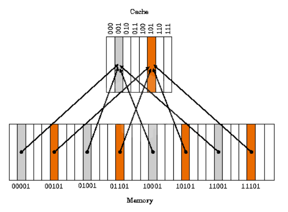
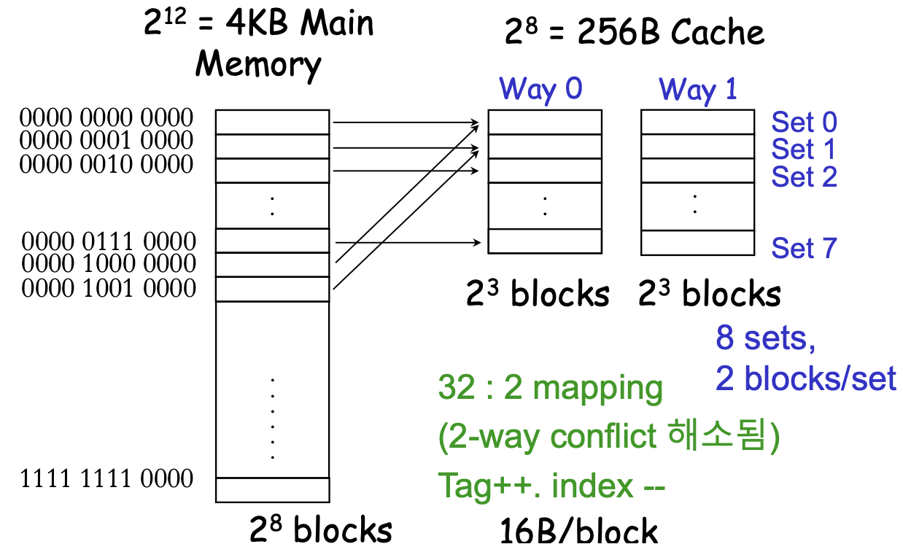

# 캐시 메모리(Cache Memory)

## 캐시 메모리란?

캐시 메모리는 매우 빠른 속도의 메모리이다.

크기는 주기억장치(메모리)보다 작지만 속도가 더빠르기 때문에 CPU와 주기억장치 사이에 위치한다.

속도가 빠른 장치(CPU)와 느린 장치(주기억장치)의 속도 차에 따른 병목현상을 줄이기 위한 범용 메모리이다.

주기억장치에서 자주 사용하는 프로그램과 데이터를 저장해두어 CPU가 캐시만 참조하여 속도를 빠르게 한다.

주기억장치와 캐시 기억장치 사이에서 정보를 옮기는 것을 사상(Mapping)이라고 한다.

매핑의 방법에는 직접 매핑, 연관 매핑, 집합 연관 매핑이 있다.

이를 위해서는 CPU가 어떤 데이터를 원하는지 어느 정도 예측할 수 있어야 한다. 예측에 따라 캐시의 성능이 좌우된다.

## 캐시의 지역성

캐시가 효율적으로 동작하려면, 캐시의 적중율(hit-rate)을 극대화 시켜야 한다.

캐시에 저장할 데이터는 지역성을 가져야 한다.

지역성이란, 데이터 접근이 시간적, 혹은 공간적으로 가깝게 일어나는 것을 의미한다.

지역성의 전제 조건으로 프로그램은 모든 코드나 데이터를 균등하게 접근하지 않는다는 특성을 기본으로 한다.

### 시간적 지역성

특정 데이터에 한 번 접근한 후, 가까운 미래에 또 한번 데이터에 접근할 가능성이 높은 것을 의미한다.

메모리의 같은 주소에 여러 차례 읽기 혹은 쓰기를 수행하는 경우라면, 상대적으로 작은 크기의 캐시를 사용해도 효율성을 꾀할 수 있다.

### 공간적 지역성

특정 데이터와 가까운 주소가 순서대로 접근되었을 경우를 의미한다.

CPU 캐시나 디스크 캐시의 경우 한 메모리 주소에 접근할 때 그 주소 뿐만 아니라 해당 블록을 전부 캐시에 가져오게 된다.

메모리 주소를 오름차순이나 내림차순으로 접근한다면, 캐시에 이미 저장된 같은 블록의 데이터를 접근하게 되므로 캐시의 효율성이 크게 향상된다.

## 캐시 라인

캐시에 데이터를 저장할 때 특정 크기만큼의 바이트 묶음으로 저장하는데, 이를 캐시 라인(Cache Line)이라고 한다.

CPU가 메모리로부터 값을 가져올 때 공간 지역성을 최대화하기 위해 캐시 라인 크기만큼 한 번에 가져온다.

캐시 라인은 32, 64, 128의 크기를 가진다. 1024 / 32

데이터가 캐시 내의 어느 곳에 저장되어 있는지 찾기 위해 모든 데이터를 순회해야 한다면 캐시의 장점을 잃기 때문에 쉽게 찾을 수 있는 구조가 필요하다.

아래에는 여러 매핑 방법을 소개한다.

### Direct Mapping

직접 매핑으로, 메인 메모리를 일정한 크기의 블록으로 나누어 각각의 블록을 캐시의 정해진 위치에 매핑하는 방식이다.

가장 간단하고 구현도 쉽다.

하지만 적중률이 낮아질 수 있고, 동일한 캐시 메모리에 할당된 여러 데이터를 사용할 때 충돌이 발생하게 된다.

### Full Associative Mapping

캐시 메모리의 빈 공간에 마음대로 주소를 저장하는 방식이다.

저장하는 것은 매우 간단하지만, 원하는 데이터가 있는지 찾기 위해서는 모든 태그를 순차적으로 검사해야 하기 때문에 탐색이 오래 걸린다.

### Set Associative Mapping

Direct Mapping과 Full Associative Mapping의 장점을 결합한 방식이다.

테이블을 여러 개 만들면 같은 태그의 메모리라도 다른 테이블의 태그에 저장하면 되는 원리라서 테이블의 개수에 따라 n-way set associative라고 부른다.

빈 공간에 마음대로 주소를 저장하되, 미리 정해둔 특정 행에만 저장하는 방식이다.

특정 메모리 주소를 탐색할 때, 해당 주소가 포함되는 Set을 구하고, Set의 Way들을 순차 탐색하면서 탐색 비용을 줄인다.

하나의 테이블을 순차 탐색 하는 것이 아니라, 여러 개의 테이블의 특정 행만 탐색하면 되기 때문에 fully associative보다는 탐색이 빠르고, direct mapping보다는 충돌이 덜 하다.

## 추가

멀티프로세서 환경에서는 코어마다 독립된 캐시를 가지게 된다고 한다.

이때 발생하는 문제는 공유자원과 비슷하게 동일한 자원을 각자의 캐시에 가져와서 한 곳만 변경이 발생한 경우 다른 코어는 변경을 알 수가 없는 문제가 있다.

이를 해결하기 위해 CPU가 캐시 라인에 있는 정보를 변경하면, 다른 CPU는 MESI 프로토콜을 통해 이러한 사실을 알아차리고, 자신의 캐시 라인에 있는 정보를 무효화 시킨다고 한다.

이는 하드웨어적으로 보장되며, 이를 cache coherency(일관성)라고 한다.

---

## 출처

[https://chelseashin.tistory.com/43](https://chelseashin.tistory.com/43)
[https://www.geeksforgeeks.org/cache-memory-in-computer-organization/](https://www.geeksforgeeks.org/cache-memory-in-computer-organization/)
[https://rebro.kr/180](https://rebro.kr/180)
[http://egloos.zum.com/sweeper/v/2983391](http://egloos.zum.com/sweeper/v/2983391)
[https://gofo-coding.tistory.com/entry/5-Set-Associative-Mapping](https://gofo-coding.tistory.com/entry/5-Set-Associative-Mapping)
