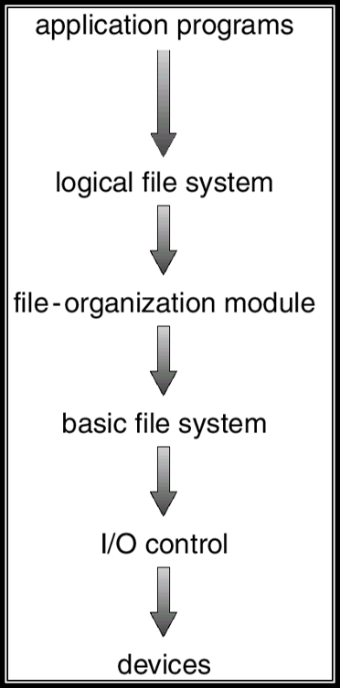
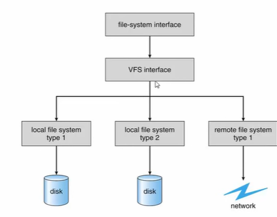

# 파일 이란?

- 보조 기억 장치에 물리적인 특성을 추상화한 **논리적인 저장 단위**
- 사용자가 데이터(문서, 이미지, 동영상)를 보조 기억 장치에 저장하기 위한 논리적인 최소 단위
- 물리적으로는, 하나 이상의 block이 하나의 파일로 되어 있음(디스크에 데이터는 block 단위로 저장)

# 파일 시스템 존재 목적

- 데이터 탐색을 빠르게 하기 위해
- 빈 공간이 발생하지 않고, 파일 크기 변화에 유연하게 block을 저장하기 위해
- 그래서, 파일 블록을 파일 시스템이 관리한다.

# 파일 시스템이란

- 운영체제에 포함된 파일 접근 및 관리 모듈, 인터페이스 제공
- 저장장치에 구성된 파일들의 저장 체계

# 파티션 vs 볼륨

- 파티션
    - 저장장치에서 파일시스템을 사용하기 **공간(구획)**
    - 하나의 저장장치에 여러개의 파일 시스템을 사용할 수 있음
    - 단, 파티션은 공간을 의미하며 파일 시스템이 없을 수 있음
- 볼륨
    - 파일 시스템이 적용 된 파일시스템(즉, 파일을 관리할 수 있는 상태)

# 파일 시스템 구조

- 파일 시스템은 **파일 관리 정책마다 구조가 다르다.**
- 운영체제 마다 파일 관리 정책이 다르기 때문에 다른 파일 시스템을 가지고 있다.
- 윈도우는 FAT 파일 시스템, 리눅스는 ext3, ext4 등을 사용한다.

## FAT 파일 시스템(Window)

1. FAT(File Allocation Table) : 파일이 할당되어 있는 위치 정보를 테이블 형식으로 가지고 있다.
2. Root directory : 디렉토리는 트리 구조로 되어 있음. 가장 상위 노드(디렉토리)를 의미한다.
3. Data blocks : 루트 디렉토리 하위에 파일, 디렉토리의 데이터가 저장되어 있는 공간이다.

## 리눅스의 파일시스템 구조

- Super block, Free space  mgmt, I-nodes는 Files and directories에 저장된 데이터의 위치를 나타낸다.
- 이러한 정보를 통해 모든 파일, 디렉토리를 탐색하지 않고 빠르게 더욱 빠르게 탐색 할 수 있는 것이다.

# 파일 시스템 레이어

## 파일시스템 레이어

- logical file system :  실제 데이터(내용)을 제외한 정보를 담고 있는  Meta data를 가지고 있다. Directory 구조를 관리하며 FCB를 가지고 있다.
- file-organiztion module : 물리 블럭과 논리 블럭을 알고 있어서 논리 주소를 물리주소로 변경
- basic file system : 적절한 드라이브를 설정하여 물리 블록에 데이터를 읽기/쓰기 등의 명령을 내린다.
- I/O control : Device driver와 interrupt handler로 이루어 져있으며 고수준 언어의 명령을 디바이스에 맞는 저수준 언어로 변경해 준다.

## 가상 파일 시스템(Virtual File System, VFS) 및 파일 시스템 레이어

- 서로 다른 파일시스템을 하나의 운영체제에 사용
- 각 파일 시스템을 위한 별도의 디렉터리 및 파일 루틴을 작성, 인터페이스를 제공 → 복잡
- 이를 해결하기 위해, 단일화 된 파일 시스템을 사용자에게 제공하여 사용을 쉽게 하기 위함
- 결국, 사용자는 `VFS` 를 통해 파일 시스템을 사용하는 것이다.

# 파일 시스템 구현 방식

## 1. 디스크 공간 할당 방법

## 연속된 공간 할당

- 한 파일을 디스크의 연속된 block 에 저장
- 효율적인 file 접근(순차 접근)
- 파일의 크기가 커진 경우에도 공간 확보 문제
    - 더 큰 공간을 미리 확보 해 두어야 함
    - **그런데, 얼마나 공간을 미리 확보할지 측정하는 것은 현실적으로 어려움**
- 파일의 크기가 큰 경우 공간 확보의 문제 → 외부 단편화

## 비연속 공간 할당

### Linked Allocation

- 파일이 저장된 block을 연결 리스트 형태로 저장
- 고정된 크기의 파일에 주로 사용 됨(파일의 크기가 변할 시 block 관리 어려움)
- 직접 접근에 비효율적
- 포인터 저장을 위한 공간 필요
- 사용자가 포인터를 실수로 건드는 경우와 같이, 신뢰성 문제
- FAT(Windows)에 사용 됨

### Indexed Allocation

- 파일이 저장된 블록의 정보(pointer)를 index block에 모아 둠
- 파일 당 인덱스 블록을 유지
- 직접 접근에 효율적, 순차 접근에는 비 효율적
- 인덱스 블록의 크기에 따라 파일의 최대 크기가 제한적

## 2. 디스크 빈 공간 관리

### Bit vector

- 시스템 내 모든 블록들에 대해 사용 여부를 flag(0 or 1)로 관리
- Bit vector 전체를 **메모리에 보관해야** 하므로 대형 시스템에 부적합

### Linked List

- 빈 블록의 시작 주소를 메모리에서 관리하고, 빈 블록은 다음 빈 블록을 가리키고 있음
- 탐색 시 비효율적인 문제

### Grouping(Linked List 응용)

- n개의 빈 블록을 그룹으로 묶고, 그룹 단위로 연결 리스트로 관리
- 연속된 빈 block을 쉽게 찾을 수 있음
- Linked List에 비해 링크 메모리 오버헤드, 탐색에 대한 오버헤드를 감소시킬 수 있음

### Counting

- 연석된 빈 블록들 중 첫번째 block과 이후의 연속적으로 빈 블록 개수를 테이블 형태로 관리
- 만약, 연속된 block의 개수가 적으면 테이블에 저장 될 데이터의 오버헤드가 커짐