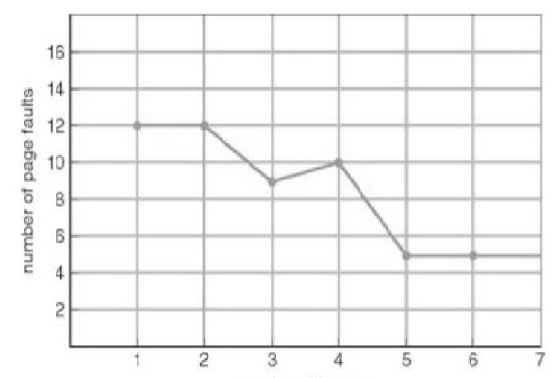

# 페이지 교체 알고리즘

운영체제는 주기억장치보다 더 큰 용량의 프로그램을 실행하기 위해 프로그램의 일부만 주기억장치에 적재하여 사용하는데, 이를 가상메모리 기법이라 한다.

가상메모리를 구현하기 위해서는 페이지 교체 알고리즘이 필요하며, 페이지 교체 알고리즘이 주기억장치에 적재되어 있는 페이지 중 어떤 페이지를 새로운 페이지와 교체될 것인지를 결정하게 된다.

## Page Fault

Page Fault는 process가 가상 메모리 주소에 접근하지만, 물리 메모리에는 로드 되지 않았을 때 발생한다.

물리 메모리는 가상 메모리보다 훨씬 작기 때문에 page fault가 발생한다.

운영체제는 새로운 페이지를 물리 메모리에 존재하는 페이지와 교체 해주어야 한다.

여러 페이지 교체 알고리즘이 존재하며, 이들의 목표는 모두 page fault의 수를 줄이는 것이다.

## FIFO (First In First Out)

가장 간단한 교체 알고리즘이다.

운영체제는 메모리에 적재되어 있는 모든 페이지들을 queue로 관리한다.

queue의 가장 앞에 있는 페이지를 가장 오래된 페이지로 생각하고 이를 교체의 대상으로 선정한다.

직관적으로 생각할 때 queue에서 관리하는 page frame 수가 증가할 수록 page pault가 적게 발생할 것 같지만,

FIFO 방식은 page frame 수를 늘렸을 때, page fault의 수가 오히려 늘어나는 기현상이 발생할 수도 있다고 한다.

이를, Belady’s anomaly라고 한다.

예로, 3, 2, 1, 0, 3, 2, 4, 3, 2, 1, 0 ,4를 3 slots(frames)으로 진행하였을 때, 총 9번의 page faults가 발생하는데, 4 slots으로 진행하였을 때, 총 10번의 page faults가 발생한다.

frame수가 증가할 수록 무조건 하강 곡선을 그리는 것은 아니다.

## Optimal Page replacement

최적의 알고리즘으로 미래를 예측해서 미래에 사용되지 않는 기간이 가장 긴 페이지를 교체 페이지로 선택한다.

가장 좋은 교체 알고리즘이지만, 현실적으로 미래의 요청을 알 수 없기 때문에 사용할 수 없다고 한다.

실제로 사용하기 보다는 다른 알고리즘과의 비교를 위한 벤치마킹 시에 사용된다고 한다.

## Least Recently Used

가장 오랫동안 사용되지 않은 페이지를 교체 대상으로 선정한다.

가장 오랫동안 사용되지 않았다면 앞으로도 사용할 확률이 적을 것이라는 가정을 하고 있다.

이는 시간 지역성(temporal locality)을 고려한 가정이다.

시간 지역성은 최근에 참조된 페이지가 가까운 미래에 다시 참조될 가능성이 높은 성질이다.

이를 구현하기 위해서는 사용된 시간을 저장해야 한다.

페이지마다 카운터를 두거나, 큐로 구현 가능하다.

카운터는 각 페이지별로 존재하는 논리적인 시계로 해당 페이지가 사용될때마다 0으로 클리어 시키며, 시간을 증가시켜 시간이 가장 오래된 페이지를 찾는다.

큐를 사용하면, 사용한 페이지를 큐에서 제거하여 맨 위로 올리고, page fault가 발생하면 맨 아래에 있는 페이지를 제거한다.

알고리즘의 단점으로 프로세스가 주기억장치를 참조할 때마다 참조된 페이지의 시간을 기록해야 하기 때문에 막대한 오버헤드가 발생한다.

## NRU(Not Recently Used), 클럭 알고리즘

최근에 사용하지 않은 페이지를 교체한다.(LRU 근사 알고리즘)

수정은 되었지만 참조되지 않는 페이지를 제거하는 것이 자주 참조되는 페이지를 제거하는 것보다 좋다는 가정을 한다.

참조와 수정 여부에 따라 교체되는 우선순위가 정해진다.

수정보다는 참조가 우선순위가 더 높다.

각 페이지마다 두 개의 비트(참조 비트, 변형 비트)가 사용된다.

적은 오버헤드로 적절한 성능을 발휘한다.

동일 그룹 내에서 무작위로 선택한다.

단, 교체되는 페이지의 참조 시점이 가장 오래되었다는 것을 보장하지는 못한다.

프로세스가 시작할 때, 모든 페이지의 비트를 0으로 설정한다.

## LFU(Least Frequently Used)

참조 횟수가 가장 낮은 페이지를 교체한다.

참조횟수를 통해 장기적 시간규모에서의 참조성향을 고려할 수 있다.

단점으로 가장 최근에 불러온 페이지가 교체될 수 있으며, 구현이 복잡하고 오버헤드가 발생한다.(min-heap으로 구현함)

## MFU(Most Frequently used)

참조 횟수가 가장 많은 페이지를 교체한다.

가장 많이 사용된 페이지가 앞으로는 사용되지 않을 것이라 가정한다.

---

## 출처

[https://www.geeksforgeeks.org/page-replacement-algorithms-in-operating-systems/](https://www.geeksforgeeks.org/page-replacement-algorithms-in-operating-systems/)
[https://www.researchgate.net/figure/Fig-2-Beladys-Anomaly-in-FIFO-algorithm-3-Now-a-days-various-memory-types-with_fig2_319997969](https://www.researchgate.net/figure/Fig-2-Beladys-Anomaly-in-FIFO-algorithm-3-Now-a-days-various-memory-types-with_fig2_319997969)
[https://examradar.com/nru-not-recently-used-page-replacement-algorithm-questions-answers/](https://examradar.com/nru-not-recently-used-page-replacement-algorithm-questions-answers/)
