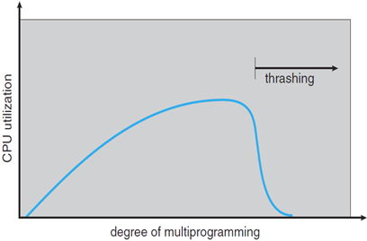
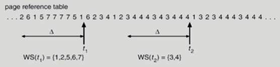
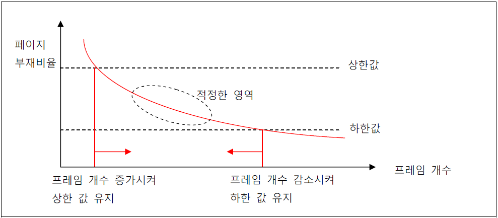
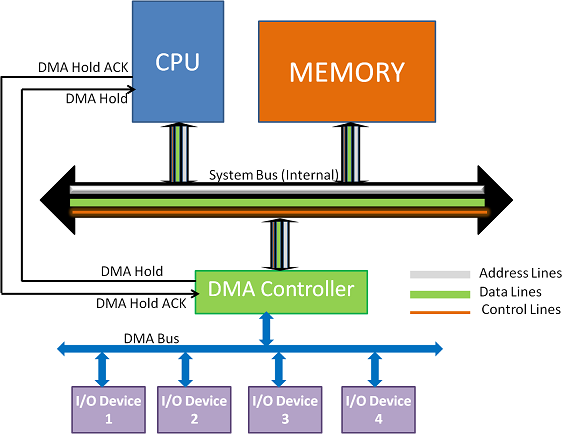
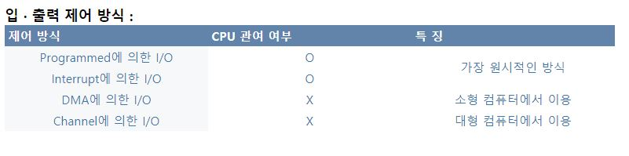

# 2022-02-08

# page fault 줄이는 방법

# Thrashing

<aside>
💡 **page fault가 빈번하게 발생**하여 페이지교체(swap-in, swap-out)하는 시간이 많아지는 현상.
프로세스를 실행하기 위한 **충분한 프레임**을 확보하지 못한다면 Page Fault는 급격하게 증가할 것이고, 이를 Thrashing 이라 함

</aside>

- page fault가 나면 cpu가 원하는 데이터를 가져오기 위해 **swap 영역과 메인 메모리 사이**에 페이지가 계속 왔다 갔다 하느라 속도가 느려짐.
- 이미 활발히 사용되는 페이지들만으로 구성되어 있기 때문에, 어떤 페이지가 교체 되던 바로 다시 페이지 교체가 필요하게 됨.

## 발생 시나리오

1. 멀티프로그래밍의 **degree를 증가**시킨다.
2. 생성된 프로세스는 추가적인 프레임을 요구하고, 이를 해결하기 위해 **전역적으로** 페이지를 교체.
3. 다른 프로세스 또한 **추가적인 프레임을 요구**하게 되고, **Page Fault가 발생**한다.
4. Page Fault가 증가함에따라 디스크 I/O 작업이 증가하기 때문에 CPU utilization이 감소한다.

## Thrashing 예방 방법

1. 각 프로세스가 필요로 하는 최소한의 프레임 갯수 보장
    1. 프레임 갯수를 늘려줌.
2. Working Set Model 매커니즘
3. PFF(Page Fault Frequency) 매커니즘

### Working Set Model

<aside>
💡 프로세스가 많이 참조(locality)하는 페이지 집합을 메모리 공간에 계속 상주 시켜 Thrashing을 줄임.

</aside>

**용어**

| Working Set | 프로세스가 실행 되기 위해 메모리에 한꺼번에 올라가 있어야 하는 페이지들의 집합 |
| --- | --- |
| Window Size | Page reference의 고정된 숫자(Working Size) 주로 △(델타)로 표시 |

- 윈도우 사이즈 가 10으로 고정된 경우
- t1의 워킹셋은 {1,2,5,6,7}이고, 워킹 셋 사이즈는 5
- t2의 워킹 셋은 {3,4}이고, 워킹 셋 사이즈는 2
- D: 모든 프로세스의 워킹셋 사이즈의 총 합.
- M: physical memory 크기
- D>M이면 스레싱이 발생하므로 OS는 D가 m보다 작도록 계속 유지 해야 함.

### **PFF(Page Fault Frequency)**

<aside>
💡 페이지폴트(page fault)빈도를 조절하는 방법으로,

페이지 폴트가 적당한 범위 기준 내에서 (상한선 , 하한선 이내에서)

발생하도록 유지하는 방식

</aside>

- page-fault rate의 상한값과 하한값을 둠.
- page fault rate이 상한값을 넘으면 frame을 더 할당
- 하한값 이하면 할당 frame 수를 줄임.
- 빈 frame이 없으면 일부 프로세스를 swap out

### 특징

- page fault 발생 시에만 실행 되기 때문에 WSM에 비해 overhead가 작다
- 수동으로 frame을 할당하여 직접 page fault 비율을 조절 가능

---

## DMA(Direct Memeory Access)가 존재하는 이유

## DMA

<aside>
💡 메모리 버퍼, 포인터, 카운터를 사용하여 장치 제어기가 **CPU의 도움 없이** DMA 컨트롤러를 이용하여 데이터를 직접 메모리로 전송하는 입출력 방식

</aside>

### 등장 배경

- 입/출력하는 장치를 위해 범용 프로세서가 매번 전송을 제어하게 하는 것은 낭비
- 인터럽트 방식이 프로그램에 의한 입출력 방식보다는 효율적이지만 입출력을 위한 상태, 제어정보,데이터 전송을 위해서는 능동적인 CPU의 개입이 필요하기 때문에 오버헤드 발생 가능

### 동작원리

- CPU는 다음 세부 정보를 DMA에 전송
    - I/O수행할 장치
    - 수행할 명령어
    - 데이터 전송을 위한 메모리 시작 주소
    - 데이터 전송 길이
- I/O 컨트롤러는 장치에 필요한 작업을 시작하고, 데이터가 준비되면 DMAC 을요청
- DMAC는 데이터 전송을 위해 HOLD 신호(시스템 버스 사용의도를 CPU에 전달하는) 발생
- 현재 사이클이 끝나면 CPU는 시스템 버스와 자신을 분리
- CPU는 HOLD ACK 신호로 DMAC에 응답하여 시스템 버스 사용할 수 있음을 나타냄
- DMAC는 메모리 주소를 데이터 전송이 발생하는 주소 버스에 배치
- DMAC에 의해 읽기 또는 쓰기 신호가 생성되고 I/O 장치는 데이터를 생성하거나 읽음. 그런 다음 DMA는 데이터를 메모리로 전송합니다.
- word coun register 레지스터는 데이터 전송길이**(length)**를 기억**.** 메모리로 전송되는 각 바이트에 대해 감소.
- **바이트 수가** 0에 도달 하면 DMAC는 CPU에 인터럽트를 생성합니다.
- ISR (Interrup Service Routine)의 일부로 CPU는 데이터 전송 상태를 수집

### 특징

- 전송이 완료되면 DMA모듈은 CPU에게 인터럽트 신호를 보내고 **CPU는 전송의 시작과 끝 부분에만 관여**
- CPU는 **상태정보, 제어정보만을 교환하게 하고** 데이터 전송은 IO장치와 메모리 간에 직접 교환하여 효율적
- DMA는 기억장치 접근을 위해 CPU의 시스템 버스 사용권을 일시적으로 뺏는 **사이클 스틸링(Cycle Stealing)**을 수행한다. 시스템 버스에 대해 CPU보다 DMA의 우선순위가 높다.

### 그 외 입출력 처리 방식의 종류

- 그 외입출력 처리 방식의 종류
  
    
    
    
    
    빠른 순
    
    1. 채널에 의한 I/O
    2. 메모리 직접 접근 I/O(DMA)
    3. 인터럽트 처리에 의한 I/O
    4. 프로그램에 의한 I/O
    
    ### **프로그램에 의한 I/O**
    
    - CPU상에서 실행되는 프로그램에 의해 입출력이 직접 제어
    - **CPU는 입출력 장치에 명령을 송신 후 동작이 완료될 때까지 대기**
    - CPU는 주기적으로 주변장치의 상태를 반복적으로 검사, 폴링 방식
    - CPU는 자원낭비 발생
    
    ### 인터럽트 처리에 의한 I/O
    
    - **입출력 인터페이스**가 주변장치의 상태를 검사하여 준비상태가 되면 **인터럽트 신호를 발생**하여 입출력 처리를 요구하는 방식
    - **CPU는 그전에 수행되던 프로그램의 상태를 스택에 저장한 후 Context Switching과정을 통해 인터럽트 서비스 프로그램 수행**
    - 주변장치에 명령을 보낸 후 주변장치로부터 결과가 올 때까지 CPU는 다른 작업을 수행할 수 있으므로 효율성 증가
    - 프로그램에 의한 I/O 문제점 개선
    - **인터럽트 방식**이 프로그램에 의한 입출력 방식보다는 효율적이지만 입출력을 위한 상태정보, 제어정보, 데이터 전송을 위해서는 **여전히 CPU의 능동적인 개입이 요구**됨
    
    ### 채널에 의한 I/O
    
    - **DMA 개념을 확장**하여 구현한 입출력만을 위한 **전용처리장치**
    - CPU처럼 독자적으로 **주기억장치에 저장된 명령어를 처리할 수 있음**.
    - **입출력 채널은 CPU의 개입없이 입출력 처리를 수행**
    - 두가지 종류의 채널
        - 선택채널(Selector Channel) : 한 번에 하나의 입출력 장치 제어
        - 다중화채널(Multiplexor Channel) : 한 번에 여러 장치에 대한 입출력 제어, 저속장치에는 바이트 다중화 채널, 고속 장치에는 블록 다중화 채널

## 참고

[[운영체제] 쓰레싱(Thrashing)이란?](http://itnovice1.blogspot.com/2019/08/thrashing.html)

[Working set - Wikipedia](https://en.wikipedia.org/wiki/Working_set)

[Working set이론](https://itdexter.tistory.com/410)