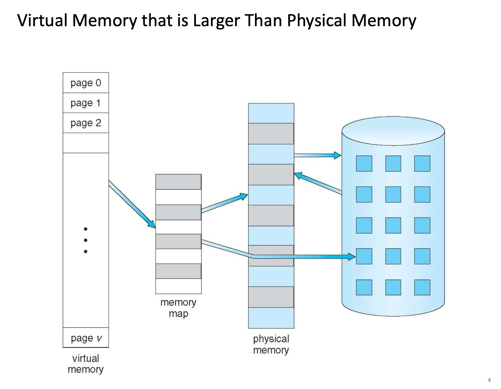
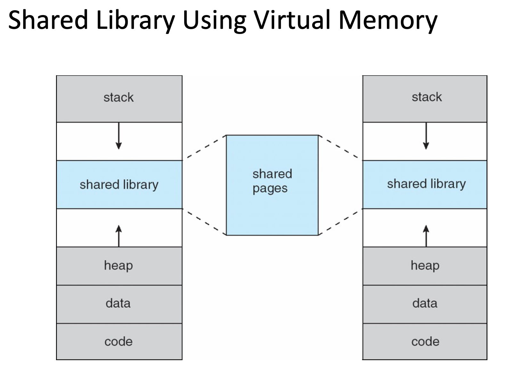
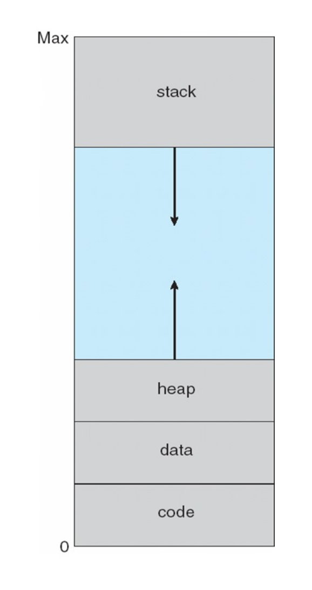
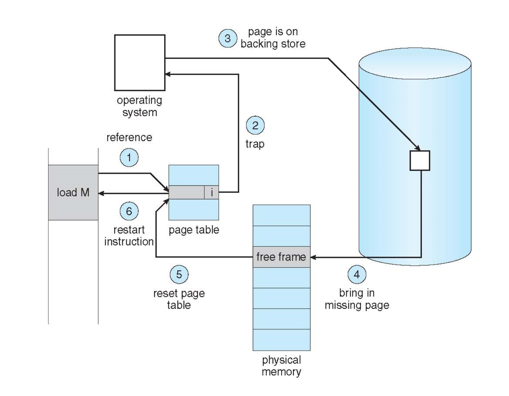
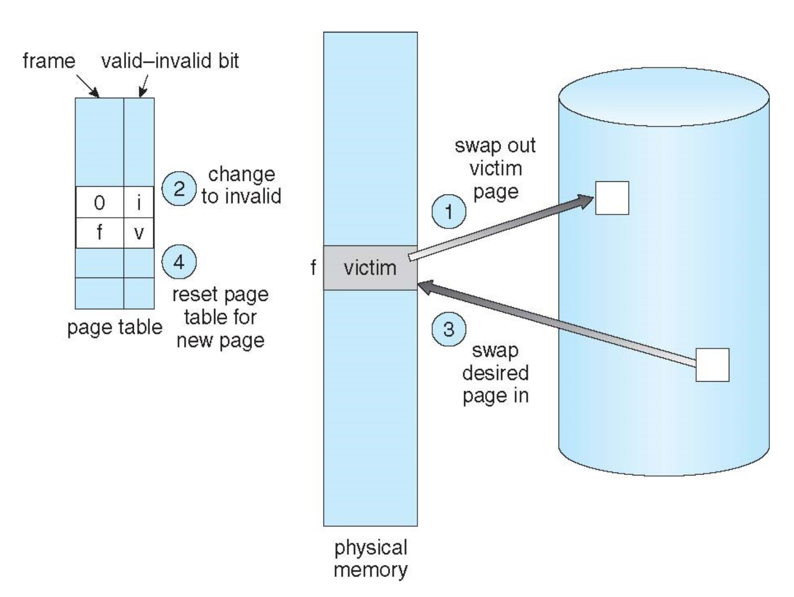
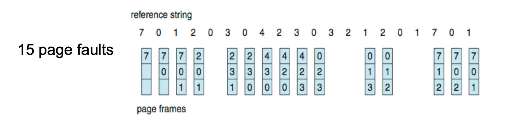
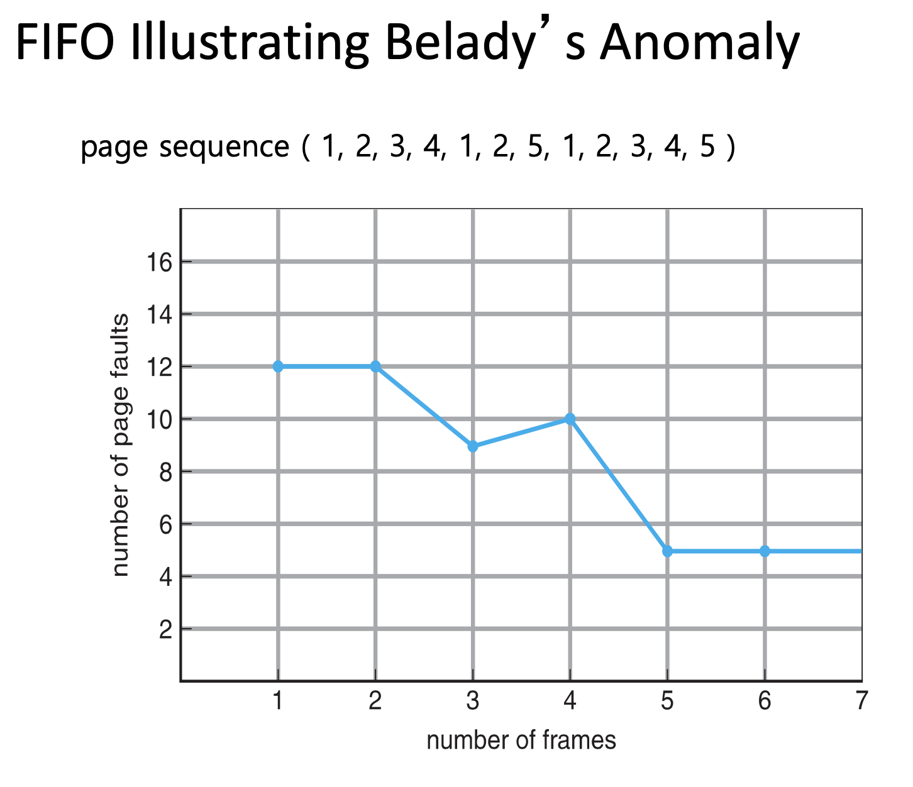
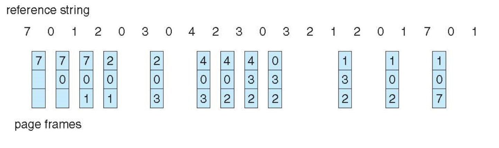

# 정원 - week3

## 가상 메모리 등장 배경

### 메모리란?

> 메모리란 프로그램과 프로그램 수행에 필요한 데이터 및 코드를 저장하는 장치이다. 메모리는 내부 기억 장치인 `주기억 장치`와 외부 기억 장치인 `보조 기억 장치`로 분류된다.
> 
- RAM, CPU 안에 있는 register와 cache memory 등 👉🏻 `주기억 장치`
- SSD, HDD 등 👉🏻 `보조 기억 장치`

<aside>
🤖 **프로그램 실행을 위해서는 코드가 메모리에 로드되어야 한다. 그러나 전체 프로그램 코드가 한번에 로드될 필요가 있을까?**

</aside>

이러한 질문에서 등장한 개념이 **가.상.메.모.리 이다.**

- 프로그램이 실행될 때, 실행에 필요한 일부분만 메모리에 올라가고 나머지는 디스크에 남게 된다.
    - 디스크가 RAM의 보조 기억장치(backing store)처럼 작동하는 방식
    

가상메모리가 등장함으로써 변화된 점은 크게 2가지 이다.

- 프로그램을 실행하는데 필요한 메모리보다 더 큰 메모리 공간이 충족되지 않더라도 프로그램을 실행할 수 있게 되었다
- 각 프로그램을 실행하는데 필요한 최소한의 메모리 공간이 사용되기 때문에 동시에 여러 개의 프로그램을 실행할 수 있게 되었다

## 가상 메모리가 하는 일

### Virtual Memory

> ***separation of user logical memory from phsycial memory***
> 
- 프로그램의 일부분만 메모리에 로드되어도 프로그램 실행 가능
- Logical Address Space의 사이즈 > Physical Address Space의 사이즈
- Address Spaces는 많은 프로세스들 간의 공유 가능
- 2개 이상의 프로그램들이 동시에 실행 가능 (concurrent processing)
- load or swap process에서 I/O가 더 적게 듦

### Virtual Address Space

> ***logical view of how process is stored in memory***
> 
- address 0부터 시작해서 address space
- physical memory는 frame 단위로, logical memory는 page 단위로 구성되어 있음
- `MMU` 의 역할 = logical ➡️ physical memory address로 mapping

## Demand Paging

> Demand Paging은 CPU가 요청할 때 프로세스의 데이터를 메모리에 올리는 것을 의미한다. 그러나 처음부터 모든 데이터를 메모리로 로드하지는 않는다.
> 

✅ 페이지의 데이터가 필요할 때만 메모리에 로드할 경우,

- Less I/O needed, no unnecessay I/O
- Less memory needed
- Fast response
- More users

특정 페이지가 필요할 때의 행동

- 페이지가 “**memory resident**” 인지 확인하는 과정이 필요하다
- 이를 확인하기 위해 **MMU address translation**을 거쳐 찾는 페이지의 Frame #에 매핑되어 있는 valid-invalid bit를 확인하다.
- 만약 해당 bit가 **valid일 경우에는 memory resident라는 뜻**이고, **invalid일 경우 (=page fault)에는 memory resident가 아니므로** 필요한 페이지를 메모리에 로드해야 한다.

### Page Fault일 경우

1. free frame을 physical memory에서 찾는다
2. disk에 있는 page를 disk operation에 맞춰서 찾아놓은 frame으로 가져온다
3. page table을 reset 시킨다 ⇒ `validation bit = v`
4. page fault를 발생시킨 동작을 재시작한다

## 페이지 교체 알고리즘

### FIFO 알고리즘

> **FIFO**: replace the first page loaded
> 
- 메모리에 가장 먼저 올라온 페이지를 먼저 내보냄.
- 간단하고, 초기화 코드에 대해 적절한 방법
- 들어온 시간을 저장하거나 올라온 순서를 큐에 저장.
- 직관적으로 생각할 때 프레임의 수가 많아질수록 페이지 결함의 횟수는 감소함
- Belady's Anomaly(FIFO anomaly)실제로 그렇지 않게 되는 현상이 나타날 수 있다.

### Optimal 알고리즘

> **Optimal : replaces page that will not be used for longest period of time**
> 

미래를 예측할 수 없기에 불가능한 알고리즘에 가까움

### LRU (Least Recently Used) 알고리즘

> **LRU : Replaces page that has not been used in the most amount of time**
> 

- 12 faults - FIFO 보다는 낫지만 OPT보단 안좋음
- 전반적으로 좋은 알고리즘이고 자주 쓰이는 알고리즘이기도 하다